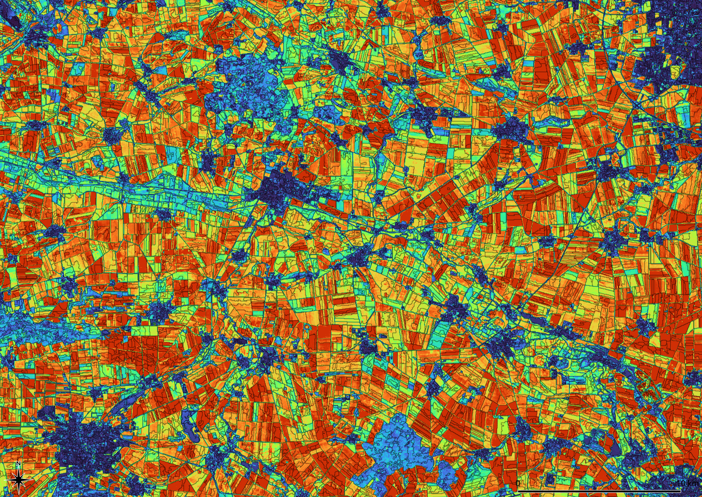

## Imalys – ESIS tool for Image Analysis

In the ESIS project we are trying to put environmental indicators on a well-defined and reproducible basis. The *Imalys* software library is supposed to generate the remote sensing products defined for ESIS. The library provides tools to select, extract, transform and combine raster and vector data. Image quality, landscape diversity, change and different landuse types can be analyzed in time and space. Landuse borders can be delineated and typical landscape structures can be characterized by a self adjusting process.

___

*Change between spring and autumn calculated as variance during the growing seasons 2014 to 2021. The image is segmented to a seamless mosaic of zones with homogeneous features. Values calculated from Landsat-8 scenes at the Bode catchment (Saxonia, Germany). Value range [0 … 0.5] depicted as blue … red*

___

Most of the methods and analyses implemented in *Imalys* are also available with commercial software and/or open source solutions. The decisive factor for the *Imalys* concept was to bundle all necessary commands and parameters into one process that contains all sub-steps and (depending on the application) only requires location, time and resulting indicators as input. 

*Imalys* was designed as a collection of building blocks (tools) to extract defined landscape properties (traits) from public available data. The whole process chain is controlled by predefined hooks and runs without manual interaction. The tools are interchangeable and can be rearranged for new tasks. *Imalys* is available as [source code](source/README.md) and as [executable](binaries/README.md) files. *Imalys* is designed to run under a server environment but can also be used on any PC. For detailed information please refer to our [tutorials](tutorial/README.md), the [manual](manual/README.md) or the [background documents](background/README.md) .

### Get Started

The easiest way to learn about *Imalys* is to run one of the [tutorials](tutorial/README.md). Copy and extract the [tutorial data](https://zenodo.org/records/11097359) to a place where you have writing permissions and follow the description. The tutorial includes all imalys tools and a stepwise description how to use them. The only thing you have to add is the [GDAL library](https://github.com/OSGeo/GDAL).

### Installation

The *Imalys* [binary files](binaries/README.md) need no installation. They can be simply copied to your */usr/local/bin* directory. To run *Imalys* the GDAL library must be available under your */usr/bin/* directory. The GDAL library can be obtained from [GitHub](https://github.com/OSGeo/GDAL). If you run Quantum-Gis the library is already installed. For details please refer to our [manual](manual/README.md).

### Usage

*Imalys* must be called with a shell or terminal. All necessary commands and parameters are passed by a single text file. Installation, commands and parameters are described in depth in our [manual](manual/README.md). A [tutorial](tutorial/README.md) provides examples of all processing steps and the combination of the *Imalys* tools. For expert users important algorithms are discussed in a [background](background/README.md) document.

### Development

*Imalys* is under development. The version 0.2 was focused on methods to select and extract appropriate images from large data collections as shipped by the providers and linking them to a seamless and high quality product for a freely selectable region. A time series over 40 years for the whole of Germany with approx. 50,000 image tiles is an example of this intention. Tools for change detection, outliers and trends will be the next step.

In version 0.3, the tasks of the *import* and *compile* tools have been changed. *Import* extracts data from archives. *Compile* has been expanded to become the central collection point for all geodata. *Compile* transfers data to the Imalys [process chain](manual/README.md), harmonizes geocorrection and pixel size and can limit the result to a selected ROI. The change means that process chains from version 0.2 are not always compatible with version 0.3. 

All noticable changes are documented in the [changelog](CHANGELOG.md). The Imalys [manual](manual/Index.md) contains a complete description of the use and syntax of all tools. 

### Get involved

*Imalys* is the answer of our current needs to detect landscape types and their change in space and time using remote sensing data. We faced the need to process large amounts of data with as little manual interaction as possible. Our solutions are predefined process chains that return defined landscape features. We call them "traits". The process chains should be independent from scaling, geographic location and sensor properties as much as possible. The concept of these process chains and their implementation as algorithms is still under development. 

The process chains are given by hooks (commands and parameters as written text). Hooks assign import data and fix the sequence of the necessary processing steps. Hooks don't require coding expertise. New process chains and new traits can be defined only by hooks. We would like to hear of both, ideas and contribution about new processes and how they can be realized!

### Contributing

If you found a bug or want to suggest some interesting features, please refer to our [contributing guidelines](CONTRIBUTING.md) to see how you can contribute to *Imalys*.

### User support

If you need help or have a question, you can use the [Imalys user support](mailto:imalys-support@ufz.de).

### Copyright and License

Copyright(c) 2023, [Helmholtz-Zentrum für Umweltforschung GmbH -- UFZ](https://www.ufz.de). All rights reserved.

- Documentation: [Creative Commons Attribution 4.0 International](https://creativecommons.org/licenses/by/4.0/) 

- Source code: [GNU General Public License 3](https://www.gnu.org/licenses/gpl-3.0.html)

For full details, see [LICENSE](https://codebase.helmholtz.cloud/esis/Imalys/-/blob/main/LICENSE.md).

### Acknowledgements

### Publications

Selsam, Peter; Lausch, Angela; Bumberger, Jan (2025): Germany Mosaic: A 40-Year High-Resolution Remote Sensing Time Series of Germany [dataset publication series]. Helmholtz Centre for Environmental Research - UFZ, PANGAEA. https://doi.org/10.1594/PANGAEA.967266

Citation: Selsam, P.; Bumberger, J.;Wellmann, T.; Pause, M.; Gey, R.; Borg, E.; Lausch, A. Ecosystem Integrity Remote Sensing—Modelling and Service Tool—ESIS/Imalys. Remote Sens. 2024, 16, 1139. https://doi.org/10.3390/rs16071139

Lausch A, Selsam P, Pause M, Bumberger J. 2024 Monitoring vegetation-and geodiversity with remote sensing and traits.Phil.Trans.R.Soc.A382: 20230058.https://doi.org/10.1098/rsta.2023.0058

### How to cite Imalys

If Imalys is advancing your research, please cite as:

Citation: Selsam, P.; Bumberger, J.; Wellmann, T.; Pause, M.; Gey, R.; Borg, E.; Lausch, A. Ecosystem Integrity Remote Sensing—Modelling and Service Tool—ESIS/Imalys. Remote Sens. 2024, 16, 1139. https://doi.org/10.3390/rs16071139

-----------------

