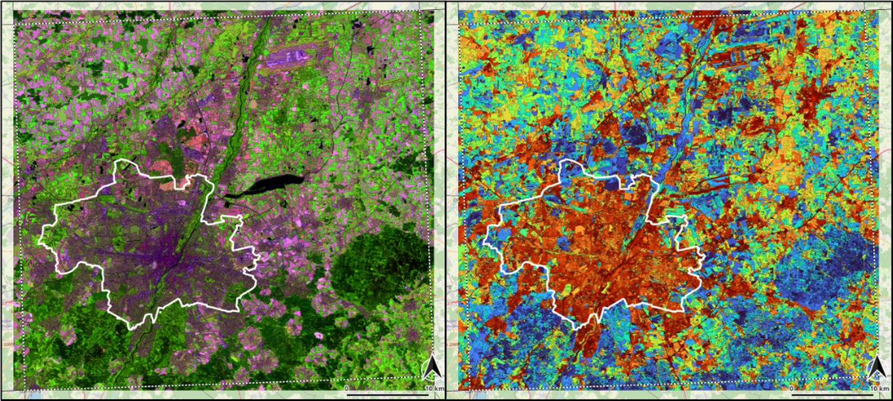

## Imalys

- *Library and executable programs for analyzing image and vector data from remote sensing*
- *Hybrid landscape model to describe functional heterogeneity and spatial coherence in a unified paradigm*
- *Predictor-free, sensor-independent, and globally reproducible results without training data*
- *Modeler-like interface in text format*
- *Designed for a Linux server environment, PC compatible*

### ESIS tools for image analysis

In the ESIS project we are trying to put environmental indicators (traits) on a well-defined and reproducible basis. The *Imalys* software tools are supposed to translate the ESIS landscape model into FAIR¹ usable results. The Imalys interface was designed to bundle all processes from data selection to the final result in a continuous and reproducible process.

*¹FAIR: Findable, Accessible, Interoperable, Reusable*



*City of Munich (Germany), Landsat 8/9, May…July 2022 • Colorized vector images based on zones • Zones boundaries depicted as thin black lines • **Left:** Color composit with bands 7-6-5 • **Right:** Brightness normalized texture within zones, Values 0 – 0.2 as Blue…Red*

------

The ESIS tools *Imalys* are available as a software library and as an executable program. Library and program provide tools to select, extract, transform and combine raster and vector data. 

 - *Seamless high quality images, spectral indicators and timelines can be created from patchy precursors*
 - *Landscape diversity, trends and landcover types can be analyzed in space and time* 
 - *Natural landscape boundaries are an intrinsic part of the resulting indicators*
 - *Landscape structures can be characterized by pattern recognition*

Most of the methods and analyses implemented in *Imalys* are also available with commercial software and/or open source solutions. The decisive factor in the *Imalys* concept was to operationalize the hybrid ESIS model and bundle all necessary commands and parameters in one process chain that contains all sub-steps and (depending on the application) only requires location, time and result names as input. 

*Imalys* was designed as a collection of building blocks (commands) to realize the different steps of the process chain. The necessary commands and parameters from data extraction to formatting the results are transferred in a simply structured text (interface). The process chain then runs without manual intervention. *Imalys* commands are interchangeable and can be rearranged for new tasks. 

Such a process chain can look like this:

```
IMALYS [Munich 2022, bestof]
home
	directory = ~/.imalys
	clear = true
	log = ~/ESIS/Results/Munich
compile
	search = ~/ESIS/Takes/Munich*2022*.tif
reduce
	select = compile
	execute = bestof
	retain = bands
export
	select = bestof
	target = ~/ESIS/Results/Munich_2022.tif
```

*The example combines all image data from “Munich” (Germany) from the year 2022 into one optimized image (see [manual](manual/5_Reduce.md)).*

------

*Imalys* is available as [source code](source/README.md) and as [executable files](executables/README.md). *Imalys* is designed to run under a server environment but can also be used on any PC. For detailed information please refer to our [manual](manual/README.md), the [tutorials](tutorial/README.md) or the [background](background/README.md) documents.

### Installation

The *Imalys* [executable files](executables/README.md) need no installation. They can be simply copied to your */usr/local/bin* directory. To run *Imalys* the [GDAL library](https://github.com/OSGeo/GDAL) must be available under your */usr/bin/* directory. If you run Quantum-GIS the library is already installed. For details please refer to our [manual](manual/README.md).

### Get Started

The easiest way to learn about *Imalys* is to run one of the [tutorials](tutorial/README.md). Copy and extract the [tutorial data](https://zenodo.org/records/11097359) to a place where you have writing permissions and follow the [description](tutorial/1_Prepare.md). The tutorial includes all *imalys* tools and a stepwise description how to use them. 

### Usage

The executable file *xImalys* must be called with a shell or terminal. The only parameter is a text file with commands and parameters (see [manual](manual/README.md)). The [tutorial](tutorial/README.md) provides examples of all processing steps and the combination of the *Imalys* tools. For expert users important algorithms are discussed in a [background](background/README.md) document.

### Development

*Imalys* is under development. The version 0.2 was focused on methods to select and extract appropriate images from large data collections as shipped by the providers and use them for a seamless and high quality product. A time series over 40 years for the whole of Germany at [Pangaea](https://doi.pangaea.de/10.1594/PANGAEA.967266) with approx. 50,000 image tiles is an example of the result. 

In the version 0.3, the tasks of the *import* and *compile* tools have been changed. *Import* still extracts data from archives. *Compile* has been expanded to become the central collection point for all processes. *Compile* transfers data to the internal processing line, harmonizes frames, projection and pixel size and can limit the result to a selected region. The current version 0.31 contains bug fixes and new import commands. All noticable changes are documented in the [changelog](CHANGELOG.md). 

### Get involved

The source code is freely available under [GNU license](LICENSE.md). The executable program *xImalys* implements 11 independent [modules](manual/README.md) for the various steps in a data analysis. These steps can be controlled by a modeller like text interface that does not require any programming knowledge. Examples can be found in the [Tutorial](tutorial/README.md). All Imalys process steps use the same internal interface and can be rearranged to form new process chains. The finished process chains are independent of the user and can be exchanged.

We would like to hear of both, new ideas and new demands and how they can be realized!

### Contributing

If you found a bug or want to suggest some interesting features, please refer to our [contributing guidelines](CONTRIBUTING.md) to see how you can contribute to *Imalys*.

### User support

If you need help or have a question, you can use the [Imalys user support](mailto:imalys-support@ufz.de).

### Copyright and License

Copyright(c) 2023, [Helmholtz-Zentrum für Umweltforschung GmbH -- UFZ](https://www.ufz.de). All rights reserved.

- Documentation: [Creative Commons Attribution 4.0 International](https://creativecommons.org/licenses/by/4.0/) <a rel="license" href="http://creativecommons.org/licenses/by/4.0/"></a>

- Source code: [GNU General Public License 3](https://www.gnu.org/licenses/gpl-3.0.html)

For full details, see [LICENSE](https://codebase.helmholtz.cloud/esis/Imalys/-/blob/main/LICENSE.md).

### Acknowledgements

### Publications

Selsam, Peter; Lausch, Angela; Bumberger, Jan (2025): Germany Mosaic: A 40-Year High-Resolution Remote Sensing Time Series of Germany [dataset publication series]. Helmholtz Centre for Environmental Research - UFZ, PANGAEA. https://doi.org/10.1594/PANGAEA.967266

Lausch, A, Selsam, P, Heege, T, von Trentini, F, Almeroth, A, Borg, E, Klenke, R, Bumberger, J: Monitoring and modelling landscape structure, land use intensity and landscape change as drivers of water quality using remote sensing. Science of the Total Environment 960 (2025) 178347: https://doi.org/10.1016/j.scitotenv.2024.178347

Selsam, P.; Bumberger, J.;Wellmann, T.; Pause, M.; Gey, R.; Borg, E.; Lausch, A. Ecosystem Integrity Remote Sensing—Modelling and Service Tool—ESIS/Imalys. Remote Sens. 2024, 16, 1139. https://doi.org/10.3390/rs16071139

Lausch A, Selsam P, Pause M, Bumberger J. 2024 Monitoring vegetation-and geodiversity with remote sensing and traits.Phil.Trans.R.Soc.A382: 20230058.https://doi.org/10.1098/rsta.2023.0058

### How to cite Imalys

If Imalys is advancing your research, please cite as:

>Selsam, P.; Bumberger, J.; Wellmann, T.; Pause, M.; Gey, R.; Borg, E.; Lausch, A. Ecosystem Integrity Remote Sensing—Modelling and Service Tool—ESIS/Imalys. Remote Sens. 2024, 16, 1139. https://doi.org/10.3390/rs16071139

[Top](README.md#Imalys)

-----------------
<a href="https://www.ufz.de/index.php?en=33573">
    
</a>

<a href="https://www.ufz.de/index.php?en=45348">
    
</a>
