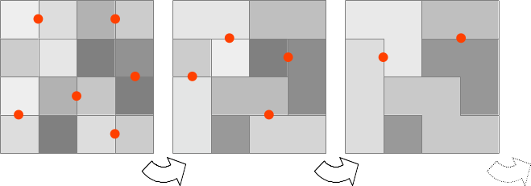

**[Home](../README.md) «» [Manual](../manual/README.md) «» [Tutorial](../tutorial/README.md) «» [Background](../background/README.md) «» [Source](../source)**

[TOC]

------

## 1 Zones and Features

One aim of the *ESIS* project is to make the diversity of the landscape structures qualitatively and quantitatively measurable. To this end, we have developed an algorithm that finds and delineates largely homogeneous areas in remote sensing images. The result is a seamless network of polygons, which are referred to below as [zones](../manual/7_Zones.md). *Zones* reflect the GEOBIA paradigm (Blaschke¹).

### Hierarchy of zones

The [zones](../manual/7_Zones.md) largely correspond to the segments in the GEOBIA concept. The [ESIS](../README.md) software tool *Imalys* does not search for gradients or edges in the image but links pixels with most similar characteristics. To do this, *Imalys* determines the variance of all pixels in the entire *zone*, analogous to Rao's ß-diversity (Rocchini², Aisling³).

***Fig.1:** Imalys combines pixels that are as similar as possible to form zones. The process compares all possible combinations of neighboring pixels or zones and adopts the combination with the lowest local diversity (red dots). The process iterates until the average size of the zones reaches a threshold*.

------

Initially, each pixel is a [zone](../manual/7_Zones.md). The process determines the variance of all possible *zones* resulting from the union of all possible pixel pairs. The *zone* with the smallest variance is registered. The process iterates over all pixels. In the end, only pixels that label each other as the most similar neighbor are merged into *zones*. 

All further runs after the initialization use the same principle. The variance of all possible [zones](../manual/7_Zones.md) from two predecessors determines which *zones* are merged. The algorithm starts with local minima of the variance and gradually works its way up to areas with increasingly higher values. 

All newly combined [zone](../manual/7_Zones.md) inherit the boundaries of their predecessors. Large *zones* combine small *zones* without forming overlaps. This makes it possible to create a hierarchy of *zones* that supports the description of the landscape in more abstract terms.

------

### Scalars and thresholds

The [Zones](../manual/7_Zones.md) command calculates the variance of the pixels for each image band separately and then forms the first principal component over all variances to determine a common measure of the “similarity” of the pixels within the *zone*. The two-step process is sensitive to both color and brightness contrasts. 

The process can basically be limited by the size of the [zones](../manual/7_Zones.md) and by the variance within the *zones*. The average size of all *zones* was selected to limit the process. The size of the *zones* is more descriptive than the variance. The threshold can be freely selected. 

In addition, the variance of the size of all resulting *zones* (*bonds =* under [zones](../manual/7_Zones.md)) can be restricted in two stages. For this option, the size or the logarithm of the size is used as an inhibiting factor. This reduces the span between small and large *zones*. In both cases, the ranking of the *zones* sizes is retained, but the differences are strongly leveled, especially in the first case.

A second option (*sieve =*) allows to remove single pixels or small [zones](../manual/7_Zones.md). The option merges all *zones* up to the selected size with the most similar neighboring *zone* that is larger than the passed threshold. As this algorithm also has to iterate, the results can lead to considerable artifacts.

------

### Features aus Pixeln

Für Features aus Pixeln verwendet Imalys normalerweise den Mittelwert aller Pixel einer [zone](../manual/7_Zones.md). Für Kernel-Prozesse, die Strukturen innerhalb einer Zone abbilden sollen, bietet Imalys eine Alternative.

Kernel-Prozesse kombinieren alle Pixel in einem kleinen Fenster (Kernel) zu einem neuen Wert, der dem zentralen Pixel zugewiesen wird. Der Prozess iteriert über alle Pixel. Das Ergebnis zeigt einen deutlichen Weichzeichner-Effekt.

Zonen folgen den natürlichen Grenzen in der Landnutzung, innerhalb einer Zone ist die Varianz der Pixel minimal. Unter [features](../manual/8_Features.md) können *Zonen* auch als Kernel verwendet werden (*normal*, *deviation*). Dabei bleiben die natürlichen Grenzen erhalten und kleine oder schmale Strukturen wie Straßen oder Bäche erhalten einem individuellen Wert. 

Für Raster-Bilder muss die entsprechende Raster-Version unter [kernel](../manual/6_Kernel.md) verwendet werden.

------

### Image and vector formats

During *zone* creation, the →zones command registers intermediate results for each *zone* to calculate the variance in the working memory. The intermediate results make the calculation much faster, but also require more memory than all other processes on the same image. 

The →zones command saves the *zones* as a raster image *index* in the working directory. *Index* contains the zone ID as the value of the pixels. For further processing size, linking and memory addresses of all zones and their contacts to other zones are registered at a database *topology.bit*. This database uses a generic format that supports fast processing.

The command also creates an (ESRI) shape file with all *zones* as polygons for convenient evaluation of *zones*. The polygons do not contain any attributes. 

------

(1) Thomas Blaschke,T. et al: Geographic Object-Based Image Analysis – Towards a new paradigm: ISPRS Journal of Photogrammetry and Remote Sensing 87 (2014) 180–191, http://dx.doi.org/10.1016/j.isprsjprs.2013.09.014

(2) Rocchini D, Luque S, Pettorelli N, et al.: Measuring β-­diversity by remote sensing: A challenge for biodiversity monitoring. Methods Ecol Evol. 2018;9:1787–1798. https://doi.org 10.1111/2041-210X.12941

(3) Aisling J. Daly, Jan M. Baetens and Bernard De Baets: Ecological Diversity: Measuring the Unmeasurable in Mathematics 2018, 6, 119; doi:10.3390/math6070119

[Top](1_Delineate.md)