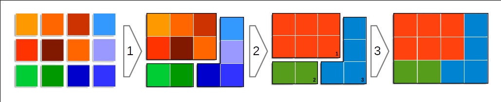
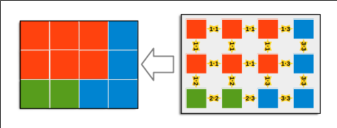

**[Home](../README.md) «» [Manual](../manual/README.md) «» [Tutorial](../tutorial/README.md) «» [Background](../background/README.md) «» [Source](../source)**

------

## 2 Mapping

- [Pixels, Zones, Objects](B_Mapping.md#Pixels-–-Zones-–-Objects)
- [Feature Space](B_Mapping.md#Feature-Space)
- [Zones and Features](B_Mapping.md#Zones-and-Features)
- [Time as an attribute](B_Mapping.md#Time-as-an-attribute)
- [Objects](B_Mapping.md#Objects)
- [Citations](B_Mapping.md#Citations)

------

### Pixels – Zones – Objects

Images of the earth’s surface are structured. Pixels with almost the same spectral combination are not randomly distributed but form clusters and sometimes regular patterns. The spectral combination of each image can be classified using the [mapping](../manual/9_Mapping.md) command. 

The [zones](../manual/7_Zones.md) command combines regions with pixels of almost the same spectral combination into *zones*. *Zones* have spectral features like pixels but the class definition can gain information from the size, shape and individual connections of the *zones*. A dark color combination of a small *zone* like a shadow might get a very different meaning in a large *zone* like a lake. *Zones* with additional features can also be classified using [mapping](../manual/9_Mapping.md) command. 

[zones](../manual/7_Zones.md) can be associated in a second step classification to form *objects*. *Objects* are defined by the specific patterns of the associated *zones* and allow to classify real world objects that are characerized by a specific combination of different elements (pattern recognition).

------

### Feature Space

The basis of all [mapping](../manual/9_Mapping.md) processes is the Euclidean distance in the n-dimensional feature space, similar to the IsoClass method. The classification process at Imalys follows Kohonen’s suggestion (Kohonen¹) where each neuron represents a separate class. According to this concept the neurons have individual properties, not only connections as neurons of the perceptron type would have (Kriesel²). One of the individual properties is a receptive field, a section of the feature space in which the neurons can recognize features. As for the rest, they are blind. This property enhances their ability to depict small but common differences. The training methods were strongly influenced by the ROLF (Kriesel²) concept.

All classification processes under [mapping](../manual/9_Mapping.md) use cluster analysis. The processes recognize and separate frequent characteristic combinations of pixels or zones. *Mapping* measures the differences between the characteristics as Euclidean distance in the n-dimensional characteristic space. The values of the different [features](../manual/8_Features.md) can be very different. Reflectances are between 0 and 1, shape attributes can be negative and areas can have multi-digit values. Parameters with large values would dominate the classes if they were not normalized beforehand with *equalize* under [mapping](../manual/9_Mapping.md).

------

### Zones and Features

In terms of zones two abstractions take place. One of them are spectral features. Zones have a spectral composition like pixels but the value is the mean of all pixels connected to one zone. Local differences or textures can not be expressed as a spectral attribute but can be added as additional →feature. Imalys introduces local contrast and the distribution of the pixels within the zones as additional features that can support the pure spectral features (diversity, entropy, normal, texture under →features). 

In addition to spectral features the size, shape and connection to other *zones* might differ considerably für single *zones*. Features derived from the geometry and neighborhood of the *zones* can be added as attributes of the *zones* polygons (cellsize, dendrites, diffusion, proportion, relation under →features). 

------

### Time as an attribute

------

### Objects

*Objects* (execute = fabric) are a spatial composition of different *zones*. If *zones* are classified according to their local →features the connection frequency of different *zones* can be used to define pattern classes among them. Add the *execute = fabric* parameter to combine *zone* and *opbject* processing under the →mapping command.

*Three steps to define an image object: Pixels of similar spectral combination are combined into zones (1). Zones are classified into clusters with typical (spectral) features (2). Specific zone combinations are aggregated to form objects* (3).

------

The class definition only depends on the frequency of the boundaries between different classes of the *zones*. The frequency is counted as pixel connections. This includes all pixels and even pixels within the *zones*. As a consequence large *objects* will be defined mainly by the (spectral) features of their *zones*, small *objects* by the specific mixture of different *zones*. This principle introduces the necessary plasticity in the *object* definition and allows intermediate states between homogeneous and patterend *objects*.

*Objects* can consist of a simple pattern of two or three *zone* classes but continuously distributed over a large area like a forest. *Objects* can also consist of only one large but homogeneous *zone* like a traffic line and possibly accompanied by a few small ligands like a waterbody. In the first instance, the object is defined mainly by the connections between *zones*, in the second instance, the connection between internal pixels dominate the *object* definition and the connections to other *zones* play a minor role (see above). In practice there is a smooth transition between both extremes.

Since the *object* class definition only depends on different frequencies, each *zone* class may occur in each *object* class. Non-specific *zone* classes such as shadows can be defined in almost all *object* classes. They are not characteristic for the *object*, but make it complete.

------

### Citations

(1) Teuvo Kohonen: Analysis of a Simple Self-Organizing Process: Biol. Cybern. 44, 135-140 (1982)

(2) David Kriesel: Neuronale Netze: http://www.dkriesel.com/science/neural_networks

------

[Top](B_Mapping.md#Pixels-–-Zones-–-Objects)
