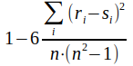

**[Home](../README.md) «» [Manual](../manual/README.md) «» [Tutorial](../tutorial/README.md) «» [Background](../background/README.md) «» [Source](../source)**

[TOC]

------

## *Compare:* validate and / or assign classes

The self adjusting classification [mapping](9_Mapping.md) is driven by image features. Real classes are not necessarily defined by their appearance. *Compare* allows to evaluate if and up to witch degree real classes can be detected by image features. The main result is a confusion matrix for false and true detection and denotation. The result can be used to assign class names and get a confidence level to the statistical outcome of the [mapping](9_Mapping.md) process. The comparison is done by a rank correlation that will be independent from the value distribution.

The standard result of *compare* command is an accuracy table. Using the *control* option, an image *accuracy* is created at the working directory, that shows only accurate classification results and gives an impression of spatial distribution of the errors. Besides the image a table *combination* with all links between reference and classification and a table *specifity* with more accuracy measures are created. 

***Caution: Compare works but is not checked under different conditions***

------

### *Reference*: Select a class reference

```
IMALYS [compare]
...
compare
	reference = compile
```

*Reference* assigns a raster or vector file to the *compare* command. If a vector file is used, a *fieldname* and the *raster* option must be added and the vector file must be transferred to a raster format.

The process compares the latest [mapping](9_Mapping.md) result with the *reference* by means of a rank correlation after Spearmann. The raster file must be a classification layer, the vector file must have appropriate attributes. A rank correlation is independent of the basic value distribution. Therefore it can be used for each set of data, even a mix of form and spectral features.

Def: 

r,s: item rank; i: item index; n: items count

------

### *Fieldname:* Mark a field in the reference table that contains class names

```
IMALYS [compare]
...
compare
	reference = refmap.shp
	fieldname = landscape-ID
```

If a vector layer has been selected as a reference, its geometry and attributes must be transformed into a raster format. *fieldname* is used to select the attribute that contains the reference classes. *Fieldname* must be specified for each reference in vector format, even if only one field exists as an attribute.

------

### *Samples:* Set the number of control samples

*Compare* compares a limited number of test points from the *reference* with the current classification in the working directory *mapping* and generates an accuracy table from this. Without *samples*, *compare* returns the statistical distribution of the classes across the references as a table.

*Compare* compares a limited number of test points from the *reference* with the current classification in the working directory *mapping* and generates an accuracy table from this. Without *samples*, *compare* returns the statistical distribution of the classes across the references as a table.

------

[Top](10_Compare.md)
