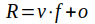

**[Home](../README.md) «» [Manual](../manual/README.md) «» [Tutorial](../tutorial/README.md) «» [Background](../background/README.md) «» [Source](../source)**

[TOC]

------

## *Import:* Select, extract, calibrate and clip images from compressed archives

Image data providers such as NASA and ESA store raw data in compressed archives. *Import* includes all the necessary tools to select and extract images from any collection of archives to the working directory. The image format is converted to the ENVI convention. 

```
IMALYS [import]
…
import
	database = ~/ESIS/archives/bonds.csv
	frame = ~/ESIS/frames/c7106.gpkg
	period = 20220501 - 20220731
	quality = 0.7
	bands = _B2, _B3, _B4, _B5, _B6, _B7
	factor = 2.75e-5
	offset = -0.2
```

Archives can be selected using a *database* (see [catalog](2_Catalog.md)) for a quick selection or individual using the *select* command. *Database* or *select* is mandatory. The *frame*, *quality*, *bands*, *factor* and *offset* parameters are used to qualify the selection and prepare the imported result. *Frame* cuts the result to the passed boundaries. *Quality* rejects any image quality below the passed limit. *Bands* extracts only the passed bands. *Factor* and *offset* calibrate the raw values to a calibrated value like reflectance or radiation.

------

### *Database:* Select an image collection database

```
IMALYS [import]
…
import
	database = ~/ESIS/archives/bonds.csv
	...
```

*Database* selects image archives as specified by *frame* and *period* and extracts them to the working directory. *Database* must be the filename of a [catalog](2_Catalog.md).

------

### *Frame:* Cut out parts of the images

```
IMALYS [import]
…
import
	database = ~/ESIS/archives/bonds.csv
	frame = ~/ESIS/frames/c7106.gpkg
	...
```

Satellite images are provided in partly overlapping tiles. *Frame* selects all tiles that cover at least a part of the *frame*. The frame must be passed as a GIS layer (polygon) and works as a Region Of Interest (ROI). About 20 different GIS formats will be accepted. The coordinate system is automatically adjusted. If the *frame* and the images do not overlap at all the result is empty. 

------

### *Period:* Select a time interval for image acquisition

```
IMALYS [import]
…
import
	database = ~/ESIS/archives/bonds.csv
	frame = ~/ESIS/frames/c7106.gpkg
	period = 20220501 - 20220731
	...
```

Period selects year, month and day of the image acquisition. The *period* must be given as YYYYMMDD - YYYYMMDD (Y=year, M=month and D=day) as shown above. *Period* relays on the date in the filename of the providers.

------

### *Quality:* Apply a quality mask to reject images

```
IMALYS [import]
…
import
	database = ~/ESIS/archives/bonds.csv
	frame = ~/ESIS/frames/c7106.gpkg
	period = 20220501 - 20220731
	quality = 0.7
	...
```

The *quality* parameter defines the lowest partition of undisturbed pixels in the passed *frame*. Quality must be passed as a figure between 0 and 1. Most of the public remote sensing images are shipped with a quality mask. This mask is used to cut out image disturbances. *Import* uses the quality mask to reject images with more dropouts than the given limit.

If individual images have to be used, the quality should be close to the maximum (1.0). If enough images from the same season are available, images with up to 50% errors (*quality = 0.5*) can be combined into a single image (see [reduce](5_Reduce.md)). The result is the most frequent value of each pixel. In many cases it is preferable to a single image.

------

### *Bands:* Select bands to be extracted from the archive

```
IMALYS [import]
…
import
	database = ~/ESIS/archives/bonds.csv
	frame = ~/ESIS/frames/c7106.gpkg
	period = 20220501 - 20220731
	quality = 0.7
	bands = _B2, _B3, _B4, _B5, _B6, _B7
	...
```

*Bands* allows to restrict the extraction to specified bands. The selection must be given as a comma separated list of band name masks. The band names of the providers are long. The band ID is a short abbreviation at the end of the name. Only these abbreviations need to be specified (see above for all optical bands of the Landsat OLI sensor). 

------

### *Factor, Offset:* Calibrate raw image data to a defined product

```
IMALYS [import]
…
import
	database = ~/ESIS/archives/bonds.csv
	frame = ~/ESIS/frames/c7106.gpkg
	period = 20220501 - 20220731
	quality = 0.7
	bands = _B2, _B3, _B4, _B5, _B6, _B7
	factor = 2.75e-5
	offset = -0.2
```

Satellite images are provided with values that support easy storage and transportation. For image analysis it is strongly recommended to use reflectance (reflection) or radiation instead of raw values. The calibration parameters are part of the metadata of the image archives but sometimes they are difficult to find. Examples for most common sensors are given in the [tutorial](../tutorials). The calibration parameters are sensor dependent and may change between the different product levels of the provider. 

 

R: Result value; v: Provided value; f: Factor; o: Offset

------

### *Select:* Select image archives by a filename (mask)

```
IMALYS [import]
…
import
	select = ~/ESIS/archives/LT05_L1TP_194024_20110422_20161209_01_T1.tar
	...
```

*Select* extracts image data from a compressed archive to the working directory. The complete path of the archive must be passed. Select can be repeated as often as necessary.

[Top](3_Import.md)
