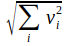
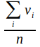
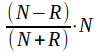
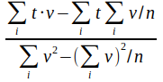
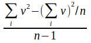

**[Home](../README.md) «» [Manual](../manual/README.md) «» [Tutorial](../tutorial/README.md) «» [Background](../background/README.md) «» [Source](../source)**

[TOC]

------

## *Reduce:* reduce the image dimension by a pixel based processing

The *reduce* command summarizes all processes that reduce the number of bands in an image. The *select* parameter selects an image from the working directory. The *execute* parameter selects one of the processes. Some of them need additional parameters. *Target* can be used to rename the result. Without *target* the results are named as the process.

*Reduce* includes 19 different processes. The *mean*, *medium*, *range*, *minimum* and *maximum* processes are calculated as expected. They can be used for quality enhancement. The *bestof* process is a mixture of them that tries to select the most reliable combination of several images. 

The additional parameters *retain = bands* or *retain = date* reduce a stack of images to a stack of bands where either different acquisition dates are combined to one multisprectral image (bands) or different images are combined to a time series with one band for each acquisition date (date). Without *retain* the input will be reduced to one layer. *Retain* can be used with all processes except *principal*. 

*Calculate* and *formula* allow free band arithmetics. The vegetation indices  *NIRV*, *NDVI*, *EVI* and *LAI* are proxies for biomass and mainly the metabolism rate of green plants. The statistical processes *variance* and *regression* return the expected values. *Weight* returns the sum of all bands.

*Reduce* accepts more than one *execute* call for the same image. All results are stored at the working directory and named as the process. 

------

### *Select* an image of the working directory to be processed

```
IMALYS [reduce]
...
reduce
	select = compile
	execute = »processes under reduce«
```

*"process under reduce" must be exchanged by a defined process name like "regression"*. 

All processes under reduce need one multiband image as input. Different bands or images should be combined beforehand with the [compile](4_Compile.md) command. [Compile](4_Compile.md) checks image properties and adds the required metadata. All examples use “select = compile” as input. With *select*, any image in the working directory can be used.

---

### *Bands:* Band selection under *NIRV, NDVI, EVI, LAI*

```
IMALYS [reduce]
...
reduce
	select = compile
	execute = NIRV
	bands = B3:B4
```

For the vegetation indices *NIRV, NDVI, EVI* or *LAI* the band number for the red and infrared bands must be specified. The counting starts with 'B1' for the first band in the image. For a Landsat image with all 6 spectral bands (0.45 µm - 2.3 µm) the third and fourth band (*B3:B4*) is needed. For a Sentinel-2 image with all 4 high-resolution bands (0.44 µm - 0.83 µm) also *B3:B4* must be passed.

------

### *Bestof:* Choose the most appropriate generalization automatically

```
IMALYS [reduce]
...
reduce
	select = compile
	execute = bestof
	...
```

The process returns an optimized image from a stack of multispectral images with lesser quality. The typical import is a short time course. Holes in the input images must be coded as NoData. 

*Bestof* relies on a quality indicator taken during the [import](3_Import.md) process. If three or more pixels in the image stack exceed the minimum quality restraints the process returns the median of all clear pixels. If only two pixels are available, the process returns the mean of both values. If the overall image qualities differs for more than 30%, only the better image is used. If only one image is available, there is no choice. The three options are evaluated individually for each pixel. 

*Bestof* can be used without the quality indicator of the [import](3_Import.md) command but the results may be insufficient.

---

### *Brightness:* Return the first principal component of all bands

```
IMALYS [reduce]
...
reduce
	select = compile
	execute = brightness
```

*Brightness* uses the first principal component of all bands as a measure of the common brightness of the whole image. If the acquisition date is preserved by *retain = time*, the result consist of a time line with one band per acquisition date.

Def: 	v: values; i: items; 

Result: [0 … positive values]

The process will convert negative values into positive ones.

------

### *Calculate:* Return pixel values based on a formula

**Operators: | + | – | * | / | < | > |**
**Only together with *formula***

```
IMALYS [reduce]
...
reduce
	select = compile
	execute = calculate
	formula = B3 / B1 – 0.45
```

*Calculate* can apply a *formula* to each pixel in the passed image. The formula must be passed as an additional parameter *formula*.

Individual bands are selected by a 'B' followed by a digit. '1' denotes the first band. The *formula* can contain Arithmetic operators for the four basic arithmetic operations ('+', '-', '*', '/'), numbers that act as constants (here '0.45') and logical operators ('>' and '<') for “greater than” and “less than” which are translated as '1' for “yes” and '0' for “no”. Calculate* translates the *formula* strictly from left to right. Parentheses or the “dot before dash” rule in algebra are not supported. In the example above, *calculate* first determines the ratio between band 3 and band 1 and then subtracts 0.45. 

---

### *Count:* Image dimension after principal component rotation

**Only together with *principal***

```
IMALYS [reduce]
...
reduce
	select = compile
	execute = principal
	count = 3
```

The *count* parameter restricts the *principal* component rotation to *count* steps. Each step reduces the number of image bands for one band. Without *count* the result of the rotations has one band less than the source. *Count* can only used together with *principal*.

---

### *Execute:* Select a *reduce* process

```
IMALYS [reduce]
...
reduce
	select = compile
	execute = brightness
```

*Execute* selects one of the possible processes under *reduce*. There are currently 19 different processes implemented. In this example *brightness* is selected. Some processes require parameters. *Execute* can be repeated as often as necessary to get different results for the same image.

------

### *Formula:* Pass an arithmetic expression

**Operators: | + | – | * | / | < | > |**
**Only together with *calculate***

```
IMALYS [reduce]
...
reduce
	select = compile
	execute = calculate
	formula = B3 / B1 – 0.45
```

*Formula* denotes an algebraic expression that is applied by *calculate* to all pixels in the image. See *calculate* for further details.

------

### *Intensity:* Calculate a landuse intensity proxy

```
IMALYS [reduce]
...
reduce
	select = compile
	execute = intensity
```

The *intensity* process combines the metabolic rate of green plants with its change over time to create an RGB image that indicates agricultural land use. Natural green is depicted as green, agricultural land as turquoise, water bodies and settlements as almost black. Mixed colors are possible and intentional.

The input data required is a time series of NIRV vegetation index images covering the entire growing season. The coverage should be as dense as possible. *Reduce* with the parameters *execute = NIRV* and *retain = time* generates the time series from ordinary image data. In Central Europe, the months of May to October have proven to be suitable. 

ESIS defines an estimate for the intensity of agricultural use (LUI) based on the values and temporal dynamics of the metabolic rate *NIRV*. *Intensity* compares the difference between the extreme values over time. For agricultural land, the period of intensive metabolism is significantly shorter.

------

### *Maximum:* Return the highest value of all bands

```
IMALYS [reduce]
...
reduce
	select = compile
	execute = maximum
```

The *maximum* process returns the highest value of all bands in the *selected* image. *Maximum* is calculated for each pixel individually. Nodata pixels are ignored. If the *retain* option is used, a stack of multispectral images can be reduced either to an image of maxima each band or a time course of maxima for the different images (see *retain*).

------

### *Mean:* Return the arithmetic mean of all bands

```
IMALYS [reduce]
...
reduce
	select = compile
	execute = mean
```

The *mean* process returns the arithmetic mean of all bands in the *selected* image. *Mean* is calculated for each pixel individually. If the *retain* option is used, a stack of multispectral images can be reduced either to one multispectral image or a time course of brightness bands (see *retain*).

Def: 	v: values; i: items; n: item count

Result: [negative values … positive values]

---

### *Median:* Return the most common value of all bands

```
IMALYS [reduce]
…
reduce
	select = compile
	execute = median
	retain = bands
```

The *median* process returns the *median* of all bands in the *selected* image. The *median* is defined as the value in the middle of a sorted list and reflects the most common value of each pixel in a stack of bands or images. The calculation is repeated for each pixel individually. If the *retain* option is used (as above) a stack of multispectral images is reduced to one multispectral image of most common values for each band. The *retain = time* option will return a multiband image with one *brightness* layer for each acquisition date.

The *median* process can mask rare values. Clouds or smoke will disappear if more than the half of all pixels show undisturbed values.

------

### *Minimum:* Return the lowest value of all bands

```
IMALYS [reduce]
...
reduce
	select = compile
	execute = minimum
```

The *minimum* process returns the lowest value of all bands in the *selected* image. *Minimum* is calculated for each pixel individually. Nodata pixels are ignored. If the *retain* option is used, a stack of multispectral images can be reduced either to an image with the minimum of each band or a time course of minima for the different images (see *retain*).

---

### *NDVI, NIRV, EVI, LAI:* Return a vegetation index

**Normalized vegetation index (NDVI)**
**Near infrared vegetation index (NIRV)**
**Enhanced vegetation index (EVI)**
**Leaf cover per area (LAI)** (deactivated)

```
IMALYS [reduce]
...
reduce
	select = compile
	execute = NIRV
	bands = B3:B4
```

The example returns the NIRV plant metabolism index using band 3 as red and band 4 as near infrared values. The band selection must be passed with *bands* and the band numbers as shown above.

Def: 	N: Near infrared value; R: Red band value

Result: [0 … 1]

The *LAI* parameter gives the proportion of leaf surface compared to the ground surface covered by the plants. The LAI was introduced as a proxy for field work. Estimated LAI values by means of estimating the solar induced chlorophyll fluorescence (SIF) seem to return minor quality.

More than 20 different vegetation indices are described (1), some of them only differ in details (2). The NIRV index tries to quantify the solar induced chlorophyll fluorescence (SIF) as a measure of plant metabolism (3) that might be most important for the evaluation of environmental services. The LAI seems to be very context dependent and is temporarily deactivated.

Most vegetation indices are calculated as the normalized difference between the near infrared and the visible red bands. The NIRV definition shows a better mapping at sparsely vegetated areas³. 

------

### *Overlay:* Overwrite values in a layer stack

```
IMALYS [reduce]
...
reduce
	select = compile
	execute = overlay
```

Overlay superimposes the *selected* images or bands in the given order. The last band has the highest priority. Gaps (NoData) remain empty until a band contains valid values. 

---

### *Principal:* Calculate a principal component rotation

```
IMALYS [reduce]
...
reduce
	select = compile
	execute = principal
	count = 3
```

The example extracts the first three principal components from a n-dimensional image. 

The *principal* component rotation tries to extract the most significant image property (see *brightness*) from the passed images, stores the result as a new band, deletes the result from the source and repeats the procedure with the remainder for *count* times. In many cases the information content of the source can be concentrated to only a few result bands. *Count* must be lower than the number of bands. 

Result: [0 … positive values]

------

### *Quality:* Create an quality assessment layer

```
IMALYS [reduce]
...
reduce
	select = compile
	execute = quality
```

*Quality* generates a grayscale image that indicates for each pixel how many original images bands are counted as valid input. 

Def: [klare Pixel im Original pro Pixel im Ergebnis]

Res: [0 … Anzahl übergebene Bilder]

------

### *Range:* Return the difference between the highest and the lowest value

```
IMALYS [reduce]
...
reduce
	select = compile
	execute = range
```

*Range* returns the absolute difference between the highest and lowest value for each band in the *selected* image. *Range* is calculated for each pixel individually. The result is always positive. 

Def: [highest value – lowest value]

Result: [0 … positive values]

------

### *Regression:* Calculate the univariate linear regression

```
IMALYS [reduce]
...
reduce
	select = compile
	execute = regression
```

The *regression* process returns the linear regression of individual pixels for all bands in the *selected* image. *Regression* tries to use the temporal distance of the recordings from the time stamps [as YYYYMMDD] at the end of the filenames. If the images are imported using the [import](3_Import.md) and the [compile](4_Compile.md) command the acquisition date is added properly. If the *retain = bands* option is used, the process returns a multispectral image of regressions for each band. 

Def: 	t: time; v: values; i: items; n: item count

Result: [negative values … positive values]

---

### *Retain:* Decide if spectral or temporal characteristics are preserved

```
IMALYS [reduce]
...
reduce
	select = compile
	execute = »processes under reduce«
	retain = time | bands
```

*"process under reduce" must be exchanged by a defined process name like "regression". "time" or "bands" are optional, if no "retain" is passed, the input is reduced to a single band.*

*Retain* can be used with each process under *reduce* except the *principal* component rotation. If *retain* is not used, *reduce* combines all selected bands to one result band. If a stack of multispectral images is selected, *retain = time* generates a multiband image with one band per acquisition date. The resulting bands reflect the result of the selected process for each acquisition date. *Retain = bands* instead combines all selected images to one multispectral image with all bands of the source images. The selected process is executed for each band separately. 

Retain will only work properly if the selected images are combined with the [compile](4_Compile.md) command. 

------

### *Target:* Rename the result of the last process

```
IMALYS [reduce]
...
reduce
	select = compile
	execute = »processes under reduce«
	target = »valid filename«
```

*"process under reduce" must be exchanged by a defined process name like "regression". "valid filename" must be replaced by a valid string without directory part. The directory is added by Imalys.*

The *target* option renames the result of the passed process. The new name is restricted to the working directory and needs no pathname. As *target* is not linked to a specific process only one process should be executed under *execute*. Choose the [export](11_Export.md) command to store one or more results at a different place.

---

### *Variance:* Return the variance based on a standard deviation

```
IMALYS [reduce]
...
reduce
	select = compile
	execute = variance
```

The *variance* process calculates the variance of all bands in the *selected* image based on a standard distribution. Each pixel is calculated individually. If the *retain = bands* or the *retain = time* option is used (see *retain*) the result is a multiband image of variances. Otherwise the result is a single band of the variance for all bands.

Def: 	v: values; i: items; n: item count

Result: [0 … positive values]

------

### *Weight:* Return the global sum of all bands

```
IMALYS [reduce]
...
reduce
	select = compile
	execute = weight
```

*Weight* returns the sum of all pixel values from all bands of the layer stack for each pixel. Unlike *brightness*, *weight* sums arithmetically. Negative values reduce the result.

------

### Literature

(1) Compton J. Tucker, Remote Sensing of Environment 8:127-150 (1979) Red and Photographic Infrared Linear Combinations for Monitoring Vegetation

(2) Gina H. Mohammeda & Co: Remote sensing of solar-induced chlorophyll fluorescence (SIF) in vegetation: 50 years of progress; Remote Sensing of Environment 231 (2019) 111177

(3) Badgley, C. B. Field, J. A. Berry, Canopy near-infrared reflectance and terrestrial photosynthesis. Sci. Adv. 3, e1602244 (2017). 

------

[Top](5_Reduce.md)

