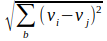

## Kernel	

**extract context features of each pixel using a moving window** 

*Kernel* module collect values in the neighborhood of each pixel and combine them to a new value. The “neighborhood” is a small square window (kernel) that is moved over the whole image. The *execute* command can be repeated as often as necessary to apply different processes to one image. The results will be named as the process. If a multiband image is assigned, the process uses common brightness of all bands.

[TOC]

The processes *texture*, *normal*, *inverse*, *deviation* *entropy* and *roughness* return information about the local diversity of the landscape. *Texture* collects the mean difference between all pixel neighbors within the kernel. The *normal* process does the same but with normalized values that makes the result independent of illumination or object brightness. The *inverse* process returns the Inverse Difference Moment (IDM⁵) to analyze dark regions. 

Unlike the “roughness” of an image, Rao’s *entropy* returns the diversity of all pixel values within the given kernel. The result is insensitive to the spatial distribution of the pixels within the kernel. A chessboard like distribution of two values will produce the highest possible texture while the *entropy* is only moderate. A continuous gradient produces almost no texture but a high *entropy*.

The *lowpass*, *highpass* and *laplace* processes change the contrast of the given image. High- and lowpass enhance or reduce the overall contrast, *laplace* is specialized for edge detection. 

The *elevation* and *hillshade* processes are dedicated for elevation models. *Elevation* creates a three layers result with slope, exposition and shade of the elevation model. The *hillshade* process can superimpose illumination and shading of the elevation model to another image.

Kernel processes are always accompanied by a soft focus effect. The [features](8_Features.md) module offers the possibility to run texture processes using [zones](7_Zones.md) instead of kernels and retain the spatial resolution.

------

### Select (Command)

**Mark an image at the working directory to be processed**

```
IMALYS [kernel]
…
kernel
	select = compile
	execute = »process under kernel«
```

All kernel processes need one image from the working directory as input. Assign this image with *select*. »process under kernel« must be exchanged with a valid process name like *deviation*.

------

### Execute (Command)

**select a kernel process**

```
IMALYS [kernel]
…
kernel
	select = compile
	execute = »first process under kernel«
	execute = »second process under kernel«
	…
	radius = »pixels between center and border of the kernel«
```

*Execute* selects one or more *kernel* processes to be executed for the same image. *Execute* can be repeated as often as necessary. »…process under kernel« must be exchanged with a valid process name like *deviation*.

------

### Deviation (Process)

**Rao‘s diversity based on pixels**

```
IMALYS [kernel]
…
kernel
	select = compile
	execute = deviation
	radius = 5
```

Rao’s diversity uses variance instead of texture to evaluate the spectral diversity of landscape structures. The variance is insensitive for the spatial distribution of the pixels within the kernel. 

​Def: 	dkl: Density difference; k,l: neighbor pixels; pk, pl: frequency of pixel values “k” and “l”

Range: [0 … positive value]

*This process is deprecated. We recommend to use Rao’s diversity based on zones (see Appendix D: Features:Entropy).*

------

### Elevation (Process)

**Extract slope, exposition and shade from an elevation model**

```
IMALYS [kernel]
…
kernel
	select = compile
	execute = elevation
	radius = 3
```

The command generates three layers called “slope”, “exposition” and “shade” from any elevation model. See *hillshade* to superimpose images with shading. The *radius* controls the generalisation of the results.

Range: [0 … 1] for each band

------

### Hillshade (Process)

**Superimpose image data with shading from an elevation model**

```
IMALYS [kernel]
…
kernel
	select = compile
	execute = hillshade
```

The *hillshade* process can superimpose the shading over each other image passed by *select* thus providing a 3D look to the result. *Hillshade* needs no parameters.

Range: [negative value … positive value] 

------

### Inverse (Process)

**Inverse Difference Moment (IDM)**

```
IMALYS [kernel]
…
kernel
	select = compile
	execute = inverse
	radius = 3
```

The *inverse* process creates a new image with the Inverse Difference Moment (IDM) proposed by Haralik⁵. The result is particularly high in dark regions and low in bright regions. It can complement *texture* and has proved useful in the analysis of settlement structures. The *radius* of the kernel can be set as necessary.

​Def: 	v: values; i,j: neighbor pixels; b: bands

Range: [0 … 4] for one band

------

### Laplace (Process)

**Enhance the local contrast**

```
IMALYS [kernel]
…
kernel
	select = compile
	execute = laplace
	inner = 1
	outer = 3
```

The Laplace process increases the image contrast. In particular edges are emphasized. The size of the emphasized structures depends on the difference of the two radius inputs. In this example the smaller radius (*inner*)  and the larger radius (*outer*) is set to '1' and '3' pixels.

*Imalys* implements the Laplace transformation as the difference between two Gaussian distributions with a different radius. The parameters *inner* and *outer* control the size (kernel radius) of the two distributions. Most like *radius* the kernel size is defined as the number of pixels between the center and the border of the kernel. 

Def: 	v: values; k: inner kernel; g: outer kernel; I,j: kernel indices

Range: [negative value … positive value]

------

### Lowpass (Process)

**Reduce the local contrast**

```
IMALYS [kernel]
…
kernel
	select = compile
	execute = lowpass
	radius = 12
```

The *lowpass* process reduces the local contrast of the image data according to the selected *radius*. *Lowpass* uses a kernel with a normalized Gaussian distribution. The kernel size can be selected freely. *Imalys* implements large kernels through an iterative process to significantly reduce the processing time.

​Def: 	v: image values; k: kernel values; i,j: kernel index

Range: [negative value … positive value]

------

### Normal (Process)

**Extract a density normalized texture of each pixels environment**

```
IMALYS [kernel]
…
kernel
	select = compile
	execute = normal
	radius = 2
```

The normalized texture does the same as *texture* but with normalized brightness. Value differences in bright regions like industrial areas will be high even if the relative differences are low. The opposite is true for dark forests. 

Def: 	vi: pixel value; vj: neighbor pixel value; b: bands

Range: [0 … 4] for one band

------

### Texture (Process)

**Extract the local texture of each pixels environment**

```
IMALYS [kernel]
…
kernel
	select = compile
	execute = texture
	radius = 3
```

The *texture* process extracts the differences between each pixel and its neighbors within a small window (kernel) and stores the first principal component of all differences to a new layer. In this example the radius of 3 pixels creates a 7x7 pixels kernel.

​Def: 	v: pixel value; i,j: adjacent pixels

Range: [0 … positive value]

------

### Inner, Outer (Parameter)

**Select the two radius sizes of the *laplace* procedure**

```
IMALYS [kernel]
…
kernel
	select = compile
	execute = laplace
	inner = 1
	outer = 3
```

The Laplace process increases the image contrast. The size of the emphasized structures depends on the difference of the two radius inputs. In this example the smaller radius (*inner*)  and the larger radius (*outer*) is set to '1' and '3' pixels.

------

### Radius (Parameter)

**Select the kernel size for all procedures except *laplace* **

```
IMALYS [kernel]
…
kernel
	select = compile
	execute = »first process under kernel«
	execute = »second process under kernel«
	radius = 3
```

The kernel radius is defined as the number of pixels between the center and the border of the kernel. The radius of the smallest possible kernel with 3x3 pixels is '1', '2' creates a 5x5 pixels kernel. Zero is not accepted.

------

### Target (Command)

**Rename the result of the last command**

```
IMALYS [kernel]
…
kernel
	select = compile
	execute = »process under kernel«
	target = »filename«
```

The *target* command renames the result of the last process. The new name is restricted to the working directory. Only the last result will be affected. Choose the [export](11_Export.md) command to store results at a different place.  »process under kernel« must be exchanged with a valid process name like *deviation*, »filename« a valid string for the new file in the working directory. 

------

[Previous](5_Reduce.md)	–	[Index](README.md)	–	[Next](7_Zones.md)

------

### Citation

[5] Haralik, R.M.; Shanmugam K.; Its’hak D.: Textural Features for Image Classification, IEEE Transaction on Systems, Man and Cybernetics, Vol. SMC-3, No. 6, Nov. 1973, pp610-621

