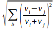

**[Home](../README.md) «» [Manual](../manual/README.md) «» [Tutorial](../tutorial/README.md) «» [Background](../background/README.md) «» [Source](../source)**

[TOC]

------

## *Features:* Create zone attributes from size, shape and pixel statistics

During [zones](7_Zones.md) creation only the boundaries of the individual *zones* are recorded. The *features* process is needed to add an attribute table to characterize the different spectral and morphological *features* of the *zones*. Each call of the *features* process will reset the whole attribute table. 

```
IMALYS [features]
...
features
	select = compile
	include = indices
	execute = cellsize
	execute = dendrites
	execute = diversity
	execute = entropy
	execute = normal
	execute = proportion
	execute = relation
	execute = texture
	diffusion = 5
	values = true
```

*Select* will assign spectral features from the image used for the [zones](7_Zones.md) delineation. Image data that were not used to delineate *zones* can be included in the same way using *include*. The images must have exactly the same size and geometry. The features will always be the mean of all pixels within one *zone*. 

*Entropy*, *normal*, and *texture* determine the texture and distribution of pixels within individual *zones*. The processes preserve image sharpness and distinguish between the features of individual structures and their boundaries. 

*Cellsize*, *dendrites*, *proportion* and *relation* add morphological features of single *zones* and relations to neighboring *zones*. *Diversity* adds the spectral diversity between *zones* as *entropy* does it for pixels. All morphological features are designed to be as independent as possible of the absolute size of the *zones*, as the absolute size can be selected freely. 

The *feature* command completely replaces the attributes table of the *zones*. Using *append*, the existing list can be extended. *Diffusion* smooths the values of the features and can thus make local maxima and outliers more apparent. With *values*, all vector attributes can be transferred to a raster image.

At the working directory, *zones* are stored as a raster image (*index*) and all *features* in an internal format (*index.bit*) for rapid processing. Use the [export](11_Export.md) command to get attributed polygons.

------

### *Append* new features to an existing attribute table

```
IMALYS [features]
...
features
	execute = cellsize
	append = true
```

*Append = true* adds the newly selected features to the existing attribute table, in this case the size of the *zones*. I this example the *cellsize* is selected by *execute*. The *features* command normally creates a new table. With *append = true* the features can be added individually.

------

### *Cellsize:* Size of the zones given as [ha]

```
IMALYS [features]
...
features
	execute = cellsize
```

The size of the [zones](7_Zones.md) is calculated as the sum of all pixels covering the *zone*. The values are given as Hectares [ha] (100m × 100m). 

​Def:  Range: [ 0 < cellsize ]

Sp: pixel size [m]; Sz: pixel per zone; 

------

### *Dendrites:* Quotient of the perimeter and the size of the zones

```
IMALYS [features]
...
features
	execute = dendrites
```

*Dendrites* returns high values if a *zone* has an elongated or finger-like shape. The *dendrites* process returns the quotient between perimeter and size of single *zones*. Both values grow with larger *zones* but the size grows faster. Large *zones* will show lower values than smaller ones with the same shape.

​Def:  Range: [ 0 < dendrites ≤ 4 ]

vr: Result Value; pz: Perimeter (zone); sz: Size (zone)

------

### *Diffusion:* Emphasize local maxima and minima for all features

```
IMALYS [features]
...
features
	...
	diffusion = 7
```

*Diffusion* emphasizes regional maxima and minima of all *features*. The algorithm mimics a diffusion through membranes. During the process, *features* “migrate” into the neighboring [zone](7_Zones.md) like soluble substances and combine with existing "concentrations". The intensity of the diffusion depends on the length of the common boundaries, the concentration difference and the selected number of iterations. The size of the *zones* provides the stock of "soluble substance".

The *diffusion* process is only controlled by the number of iterations (*diffusion = number*). Each iteration enlarges the region of contributing *zones*. The influence of distant *zones* on the central *zone* decreases with distance. Entries over 10 are allowed, but rarely have a visible effect. The process influences small *zones* much more than large ones, as *diffusion* only takes place at the boundaries between the *zones*.

​Def:  Range: [ as parameters above ]

a: attribute value; s: zone size; c: pixel contacts; i,j: zone indices; t: iterations (time)

------

### *Diversity* of the central zone and all neighbors

```
IMALYS [features]
...
features
	execute = diversity
```

*Diversity* mimics the spectral diversity at pixel scale for *zones*. As *zones* differ in size, shape and shared edges the diversity is not a simple mean but is calculated from the length of the shared boundaries. For multispectral images the deviation of the different bands is calculated independently and the principal component of all deviations is taken as the final value. *Entropy* on pixel level and *diversity* on zone's level are both based on deviation but are calculated on very different scales. As diversity is strongly dependent on scaling the comparison between both might be interesting.

The diversity between zones is calculated as the statistical deviation of all attributes between the central *zone* and all its neighbors. As the *zones* might differ considerably in size and shape the length of the common border was selected as a measure for the contribution of the peripheral *zones* to the final value. 

​Def:  Range: [ 0 ≤ dendrites ]

vi: Pixel value; vn: Neighbor value; bp: Pixel boundaries

------

### *Entropy:* Pixel diversity following Rao’s proposal

```
IMALYS [features]
...
features
	execute = entropy
```

*Entropy* calculates Rao’s Entropy or ß-Diversity using [zones](../backgrond/B_Zones.md) instead of a [kernels](6_Kernel.md). Texture based methods like *texture* or *normal* compare adjacent pixels and return the “roughness” of the image whereas *entropy* compares all pixels within a given region. Regular pattern like a chessboard will show a high roughness but their diversity might be comparably low.  *Zones* retain natural boundaries and thus avoid a considerable [blurring](../background/B_Zones.md) caused by the *kernel*. 

The *entropy* process returns the spectral deviation of all pixels within one zone. For multispectral images the deviation is calculated independently for each band and the first principal component of all deviations is taken as the final result. The entropy values are calculated using the Gauss's formula for deviation.

​Def:  Range: [ 0 ≤ entropy ]

dij: Density difference; I,j: neighbor pixels; pi, pj: frequency of pixel values “i” and “j”

------

### *Execute:* Add geometry features as attributes

```
IMALYS [features]
...
features
	execute = cellsize
	execute = dendrites
	execute = diversity
	execute = entropy
	execute = normal
	execute = proportion
	execute = relation
	execute = texture
```

The *execute* process adds morphological and textural *features*. Purely spectral *features* can be added with the *select* process. 

Currently four different *features* (*cellsize*, *dendrites*, *proportion*, *relation*) are defined to describe the geometry of the *zones* and their surroundings, one (*diversity*) for the diversity between *zones*, two (*texture* and *normal*) to determine texture *features* within individual *zones* and one (*entropy*) to determine the diversity within the *zone*. Each process and parameter is explained in detail under its name. Different *features* can be called individually or together.

------

### *Include:* Add features from additional images

```
IMALYS [features]
...
features
	include = indices
```

Additional image data such as elevation models, temperature or indices that were not used to delineate the zones can be linked to the *zones* as features using *include*. As with the image data, the mean value of all pixels in a *zone* is used as the new feature. The images must show exactly the same section and geometry as the image data in *select*. In the example, an image “indices” is taken from the working directory.

------

### *Interflow:* Functional feature connections

*Interflow* is designed to quantify functional feature concentrations and local defects. The results are not yet satisfactory.

------

### *Normal:* Normalized pixel texture for individual zones

```
IMALYS [features]
...
features
	execute = normal
```

As the *texture* process does, *normal* returns the mean difference between all pixel pairs within an individual zone but in this case the difference is normalized by the mean brightness of the compared pixels. 

​Def:  Range: [ 0 ≤ normal ≤ 1 ]

vi: pixel value; vj: neighbor pixel value; b: bands

------

### *Proportion:* Size diversity of the central zone and all neighbors

```
IMALYS [features]
...
features
	execute = proportion
```

The *proportion* process returns the relation between the size of the central zone and all its neighbors. The result is calculated as relation between the size of the central zone and the mean size of its neighbors. As the size is given in a logarithmic scale, the “mean” is not an arithmetic but a geometric mean. Values around one indicate equally sized neighbor zones. 

​Def:  Range: [ 0 < proportion ]

si: Size, central zone; sj: Size, neighbor zone; n: number of neighbors

------

### *Relation:* Quotient of neighbors and perimeter of the zones

```
IMALYS [features]
...
features
	execute = relation
```

*Relation* is calculated as the relation between the number of neighbor zones and the perimeter of the central zone. Like *dendrites* also *relation* returns information about the shape and the connection of the zones. Zones with many connections may provide paths for animal travels and enhance diversity.

​Def:  Range: [ relation < 1]

r: relation; c: number of neighbors; p: perimeter

------

### *Select:* Assign spectral features as zone attributes

```
IMALYS [features]
...
features
	select = compile
```

The *select* process adds all spectral features of the selected image to the attribute table. The band names are used as field names if possible. In all examples, the result of the last [compile](4_Compile.md) command is used.

------

### *Texture:* Pixel texture for individual zones

```
IMALYS [features]
...
features
	execute = texture
```

The *texture* process adds the mean difference between all pixel pairs within each [zone](7_Zones.md). The process thus returns the “roughness” of the zone. The *normal* process will return a brightness independent result.

​Def:  Range: [ 0 ≤ texture ]

v: pixel value; i,j: adjacent pixels; 

------

### *Values:* Convert all zones and their attributes to a raster image

```
IMALYS [features]
...
features
	...
	values = true
```

The *values* process creates a multi band raster image from all attributes of the *zones*. *Values* mainly serves as a control feature. 

[Top](8_Features.md)
