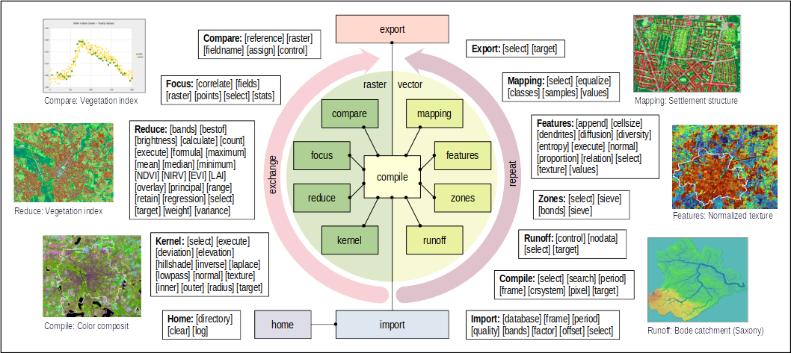

**[Home](../README.md) «» [Manual](../manual/README.md) «» [Tutorial](../tutorial/README.md) «» [Background](../background/README.md) «» [Source](../source)**

[TOC]

------

## Imalys Commands

*Imalys* includes a large number of commands and parameters due to the variety required. [Commands](README.md) execute basic functions, *parameters* select processes and accept inputs.

*The figure shows how the individual steps (commands) are linked. 8 commands (“compare” ... “runoff” in the center of the graphic) control process steps, “compile” organizes the data exchange. “Import” and “export” select and transform input and output data. “Repeat” and “exchange” (arcs) control the program flow. “Home” identifies the user. The 8 central commands can be linked and repeated in any order.*

*The process steps (commands) can be recombined for numerous tasks, just like in a modeler. The white fields show a summary of the parameters. Complete process chains can be exchanged between users. Only the names of the input and output data need to be adapted.*

------

## Imalys Manual

*Imalys* is called with a command line ([Run Imalys](0_Execute.md). Each command (below) controls an independent function. All commands and parameters of a process chain are passed in a single script (hook). The *manual* contains definitions and examples of all commands:

- **[Run Imalys](0_Execute.md):** Set up and control *Imalys* process chains

- **[Home:](1_Home.md)** Select a working directory and define paths for protocols

- **[Catalog:](2_Catalog.md)** Create a database with the position and acquisition times of archived image data

- **[Import:](3_Import.md)** Select appropriate images from a collection of compressed archives, calibrate the values and cut them to a selected frame.

- **[Compile:](4_Compile.md)** Transform, reproject, combine, cut and arrange images as input for all further commands. 

- **[Reduce:](5_Reduce.md)** Combine or compare pixels in different bands, create indices, analyze time series and return principal components.

- **[Kernel:](6_Kernel.md)** Combine pixels from the local neighborhood of each pixel to new values, change contrast and filter edges

- **[Zones:](7_Zones.md)** Creates a seamless network of image partitions (*zones*) with largely identical pixel characteristics

- **[Features:](8_Features.md)** Determine spectral combinations, texture, shape and linking of *zones* and save them as vector attributes

- **[Mapping:](9_Mapping.md)** Classify pixels, *zones* or spatial patterns of *zones* (objects)

- **[Compare:](10_Compare.md)** Compare classes with references 

- **[Export:](11_Export.md)** Transform processing results into another image format. *Zones* and classes can also be exported in vector format.

- **[Replace:](12_Replace.md)** Set and change variables in a process chain. Structurally identical processes can be repeated automatically with different commands and parameters.

[Top](README.md)
