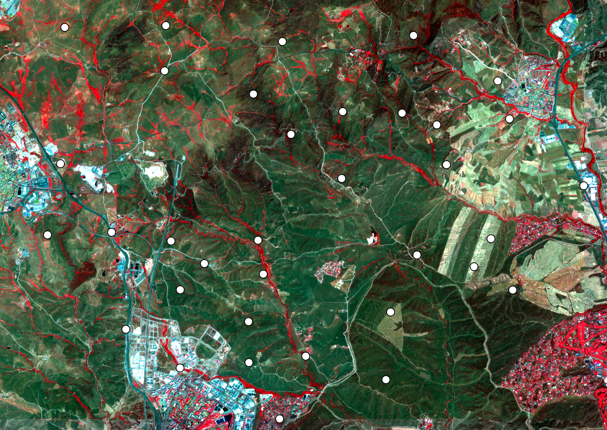
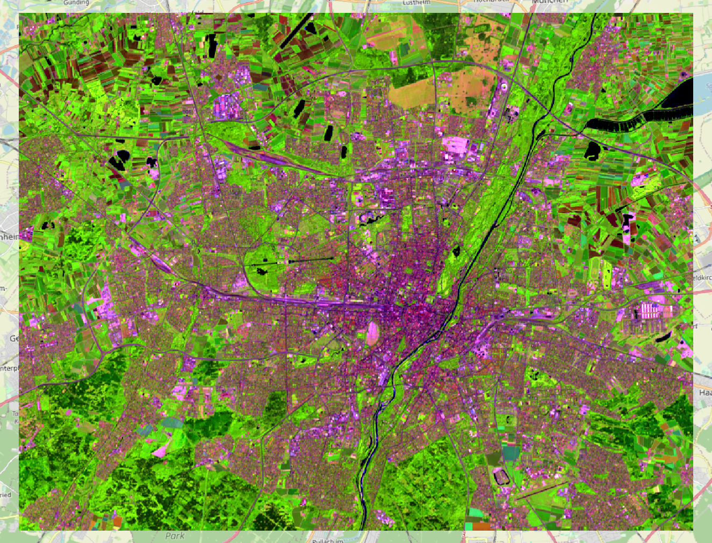

**[Home](../README.md) «» [Manual](../manual/README.md) «» [Tutorial](../tutorial/README.md) «» [Background](../background/README.md) «» [Source](../source)**

[TOC]

------

## 2 Seamless image products

Satellite image data are shipped in compressed archives, the tracks are cut into tiles, different bands are stored to different files and the image values support compression. The [import](../manual/3_Import.md) and the [catalog](../manual/2_Catalog.md) commands are designed to collect the necessary data, check their quality and return calibrated images within a given frame. The [compile](../manual/4_Compile.md) command is to store all images with a common projection, pixel size and file format and arrange different parts of a larger image to a seamless result.



*Selection points and image data for entomological research at the north of Madrid; Sensor: Sentinel-2; Bands: 8-4-3 (Infrared); Date: 12 June 2021; Calibration: TOA Reflectance; Section: Test area; Source: ESA*

------

The [import](../manual/3_Import.md) command uses a lot of parameters to return most appropriate images. *Select* accepts the archive name(s), *frame* cuts the scene to a given region, *period* selects the acquisition time, *quality* rejects images with more than the given partition of errors and finally *factor* and *offset* transfer the result into calibrated values. Except of *select* or *search*, none of these parameters are mandatory. 

-----

### 2a Extract, calibrate and crop images

The first tutorial is to import the 6 optical bands of 4 known Landsat images, cut them to the frame of a Region Of Interest (ROI) and calibrate the results to Top Of Atmosphere (TOA) reflectance.

If the image source is known, the archive name(s) can be passed with *select*. *Select* can be repeated as often as necessary. The archives must exist. 

The *frame* parameter cuts out the ROI. *Imalys* expects a vector file to define the ROI. The result will be a rectangle including all points of the given geometry. *Select* without *frame* will import all bands of the archive. This will be rarely necessary and the calibration can depend on the wavelength.

To compare images or calculate indices the values of the archived images must be *calibrated*. TOA reflectance is the most common format, radiation [W/m²] is another option. The calibration parameters are part of the image metadata. As an example, *factor* and *offset* for TOA reflectance are given for the optical bands of Landsat 5-9 and Sentinel 2:

| Sensor                | Factor      | Offset |
| :-------------------- | ----------- | ------ |
| Landsat 5,7,8,9       | 2.75e-5     | -0.2   |
| Landsat B10 (thermal) | 3.418023e-3 | 149.0  |
| Sentinel-2            | 1e-4        | 0      |

```
IMALYS [process chain 2a]
home
	directory = ~/.imalys
	clear = true
	log = ~/ESIS/results
import
	select = ~/ESIS/archives/LC08_L2SP_193026_20220515.tar
	select = ~/ESIS/archives/LC08_L2SP_193026_20220531.tar
	select = ~/ESIS/archives/LC08_L2SP_193026_20220702.tar
	select = ~/ESIS/archives/LC08_L2SP_193026_20220718.tar
	frame = ~/ESIS/frames/bounding-box.shp
	quality = 0.70
	bands = _B2, _B3, _B4, _B5, _B6, _B7
	factor = 2.75e-5
	offset = -0.2
```

At tutorial 2a the [import](../manual/3_Import.md) command *selects* four Landsat-8 OLI images, extracts them from the tar-archive, cuts them with *frame* to the extend of the *bounding-box.shp*, rejects images with less than 70% clear pixels within the *frame* (*quality*), extracts the six optical *bands* of the OLI sensor, calibrates the values to TOA reflectance (*factor, offset*) and stores the images as a layer stack at the working directory. The extracted images are named according to the sensor, the tile and the date of the image acquisition.

The *home* process is necessary for each process chain (see [Prepare](1_Prepare))

------

### 2b Enhance image quality

A main problem of satellite images are dropouts due to cloud coverage. Less noticeable but of similar importance is the seasonal change of the landscape features. Each image is a snapshot. Dropouts and changes can be controlled by collecting information from similar images at different acquisition times. Tutorial 2b shows how to extract a seamless image with typical values out of a couple of patchy images.



*Reduce* with *execute = bestof* uses the median of all selected images to return the most common value for each pixel in an image stack. The result is a “typical” value for a short time period. Almost everywhere clouds are random in time. If the majority of each pixel in an image stack is clean, the most common value is free of clouds and cloud shadows. To get an impression how the process works, compare the imported images from October, September and August (tutorial 2d) with the result of the *bestof* process. 

```
IMALYS [process chain 2b]
home
	directory = ~/.imalys
	clear = false
	log = ~/ESIS/results
compile
	search = LC0*.hdr
	period = 20220501-20220731
	crsystem = 32632
	pixel = 30
reduce
	select = compile
	execute = bestof	
	preserve = bands
export
	select = bestof
	target = ~/ESIS/results/bestof_summer.tif
```

Tutorial 2b uses the results of tutorial 2a. The default working directory *~/.imalys* is assigned by the [home](../manual/1_Home.md) command but not cleared to use the imported images for subsequent processes.

The [compile](../manual/4_Compile.md) command is mandatory if different images should be compared or processed together. In this case the *search* parameter selects all Landsat images and the *period* parameter under [compile](../manual/4_Compile.md) filters the selection to images taken from May to July. *Search* uses the ENVI metadata ending to select only the images. Without this specification image and metadata files would be selected. *Compile* also controls the position of different frames and reprojects the images if necessary. The result name includes sensor and time.

The [reduce](../manual/5_Reduce.md) command transforms the compiled stack to a new image. Using the *preserve = bands* parameter *bestof* reduces a multi image stack to one image with the same bands or colors as one of the original images. The *bestof* process tries to return the most significant content of the different bands. *Bestof* depends on the extended image metadata that [compile](../manual/4_Compile.md) provides. 

The [export] process transfers the image into a Geo-TIFF and stores the result to a freely selected place. The new image format is defined by the extension. No extension will select the ENVI labeled format as it is used at the working directory.

The results of the [compile](../manual/4_Compile.md) and the [reduce](../manual/5_Reduce.md) commands are called without a path name. If no path is given, *Imalys* looks at the working directory.

------

### 2c Image collection database (catalog)

*Imalys* can create a local image archives database to select images effectively. The database stores the acquisition date together with the tile boundaries of the archived images. The database is formatted as vector geometry to have a look at it using a GIS. 

There is no need to call the [catalog](../manual/2_Catalog.md) together with the [import](../manual/3_Import.md). The *catalog* must only be recalculated if the collection of archives has changed.

```
IMALYS [process chain 2c]
home
	directory = ~/ESIS/.imalys
	clear = true
	log = ~/ESIS/results
catalog
	archives = ~/ESIS/archives/*_L2SP_*.tar
	target = ~/ESIS/archives/bonds.csv
```

Tutorial 2c creates a search database of all archives at the directory *archives* and stores it as *bonds.csv*. The search is restricted to the passed directory. The accepted archives can be filtered using a usual file name filter like *\*\_L2SP\_\** for Landsat level-2 products. 

------

### 2d Import with an Image Catalog

The image catalog was designed to select appropriate image tiles out of a large collection of archives. 

If a *frame* is given, only tiles that cover or touch the frame will be selected. The *quality* process controls the partition of clear pixels within the selected frame of each image. The parameter *period* defines a schedule for the acquisition time. 

```
IMALYS [process chain 2d]
home
	directory = ~/.imalys
	clear = true
	log = ~/ESIS/results
import
	database = ~/ESIS/archives/bonds.csv
	period = 20220501-20221031
	frame = ~/ESIS/frames/bounding-box.shp
	quality = 0.7
	bands = _B2, _B3, _B4, _B5, _B6, _B7
	factor = 2.75e-5
	offset = -0.2
```

Tutorial 2d uses an image [Catalog](../manual/2_Catalog.md) to [import](../manual/3_Import.md) all example images. [Home](../manual/1_Home.md) clears the working directory and the archive selection is set to an acquisition date between May and October. Everything else is like tutorial 2a.

------

### 2e	Select and reduce a short time course

Time periods can be selected during the image [Import](../manual/3_Import.md) but as well with the [Compile](../manual/4_Compile.md) command if imported images are available. The selection will only work if the acquisition time is part of the image filename.

```
IMALYS [process chain 2e]
home
	directory = ~/.imalys
	log = ~/ESIS/results
compile
	search = LC0*.hdr
	period = 20220801-20221031
reduce
	select = compile
	execute = bestof
	preserve = bands
export
	select = bestof
	target = ~/ESIS/results/bestof_autumn.tif
```

The results of tutorial 2d must be available at the working directory!

Tutorial 2e is nearly identical to tutorial 2b except the time period under [Compile](../manual/4_Compile.md) and [Export](../manual/11_Export.md). The result of T2e is an 6 band image of the second half of the vegetation period of 2022. 

[Top](2_Images.md)