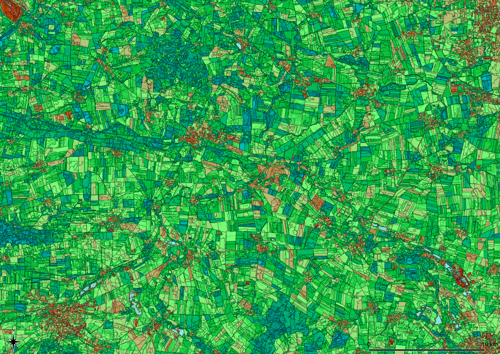
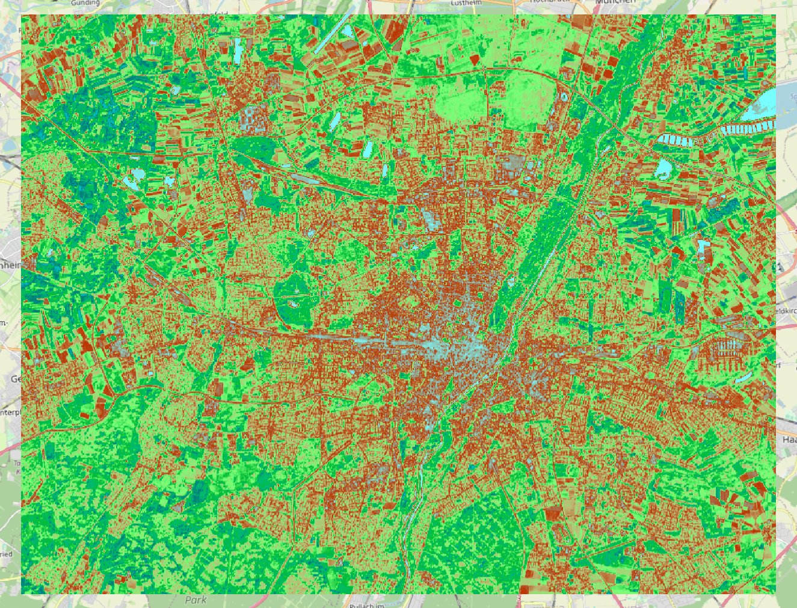
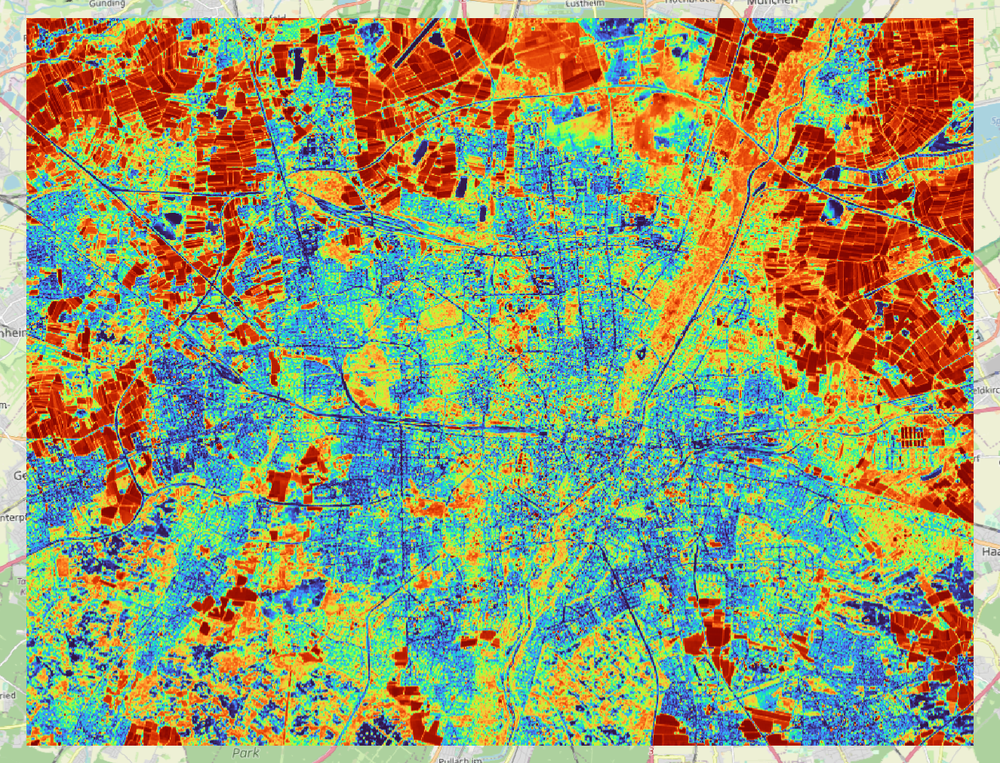
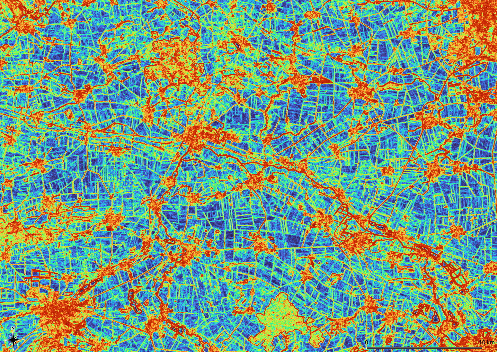
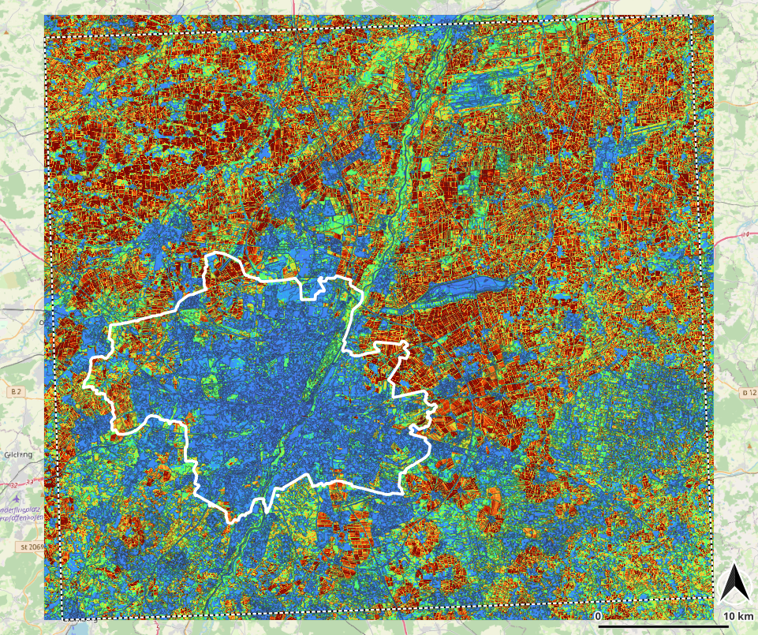
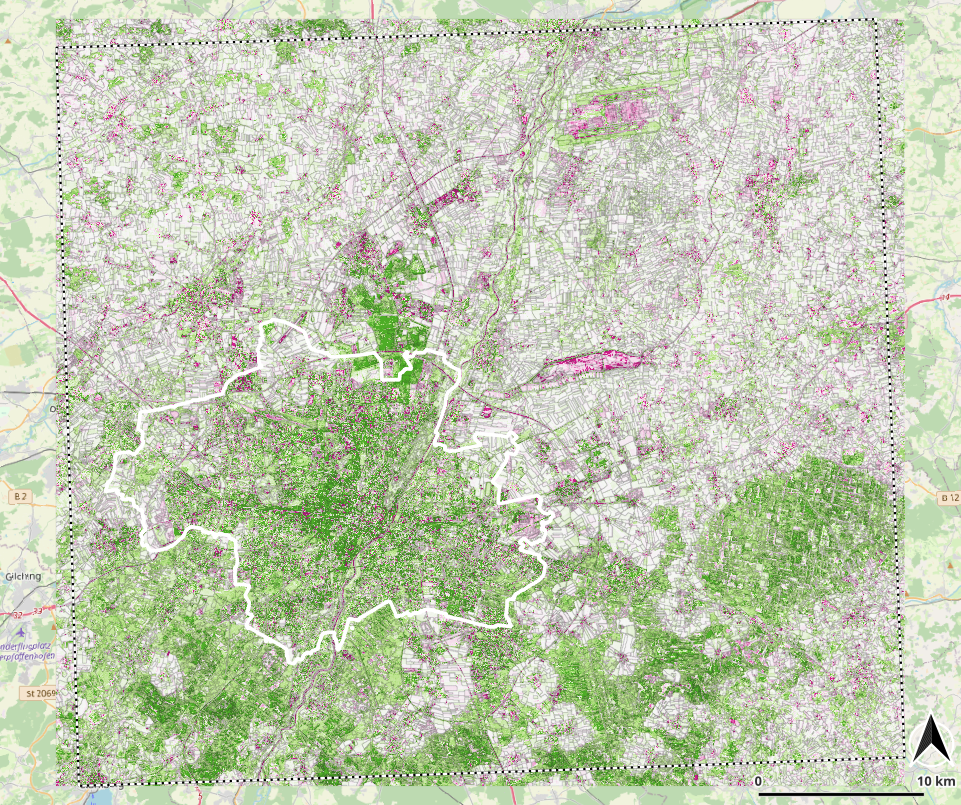
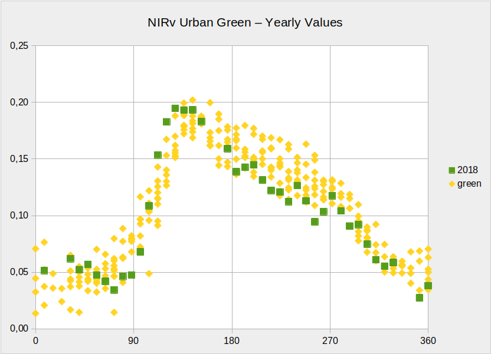

**[Home](../README.md) «» [Manual](../manual/README.md) «» [Tutorial](../tutorial/README.md) «» [Background](../background/README.md) «» [Source](../source)**

[TOC]

------

## 3 Indices and pixel arithmetic

Pixel arithmetics, kernel and indices are used to get new values from a specific collection of pixels. The collection might be a time line, neighbors of a central pixel or different bands. The ratio of two, three or on rare occasions four different bands is traditionally used as an indicator for features that are not directly visible. The most well-known are the vegetation indices (NDVI, EVI, LAI, ...). These indices are based on the reflections at different frequencies (bands, colors).

Besides comparing bands of one image, *Imalys* includes several routines to process time series and to analyze the vicinity of single pixels to control the image contrast or record local variability.



*Fig. 3.1: Near Infrared Vegetation NIRv at “Hohes Holz” and “Großer Bruch” in the Bode catchment area, Germany. Landsat-8. First half of the growing season 2014-2020. Narrow black lines mark boundaries of land use (*zones*). The NIRv values range between 0.0 (turquoise) and 0.4 (dark green).*

------

A Quantum GIS [color palette](../images/NirV.qml) for NirV is provided. To use this palette, select the "properties" menu with "layer", set the "min" and "max" value to 0.0 and 0.4 respectively and select the NirV.qml palette with the "style" command at the properties menu.

-----

### 3a Vegetation indices

*Imalys* has implemented four vegetation indices (*NDVI, NIRV, EVI, LAI*). The user should take into account that all vegetation indices are approximations. They assume spectral dependencies and also depend on the type of the sensor.

In addition to special data sources, there are numerous other methods to derive proxies for features such as soil moisture from the visible image data. 

```
IMALYS [tutorials 3a]
home
	directory = ~/.imalys
	log = ~/ESIS/results
compile
	search = LC0*.hdr
	period = 20220801-20221031
reduce
	select = compile
	execute = bestof
	retain = bands
reduce
	select = bestof
	execute = NirV
	execute = NDVI
	bands = B3:B4
export
	select = NirV
	target = ~/ESIS/results/NirV.tif
export
	select = NDVI
	target = ~/ESIS/results/NDVI.tif
```

Tutorial 3a demonstrates how to rearrange intermediate results to two different pixel indices. The [compile](../manual/4_Compile.md) command selects images of the second half of the vegetation period. The first [reduce](../manual/5_Reduce.md) command creates an optimized 6 band image.

The second [reduce](../manual/5_Reduce.md) command calculates the vegetation index *NDVI* and the metabolism index *NirV*. To calculate the indices, the position of the red and the near infrared bands within the image must be passed as a _formula_. The band numbers are counted from "1" to the upmost layer "6". If the input images are identical, the _reduce_ commands can be concatenated. Two [export](../manual/11_Export.md) commands save the results as Geo-Tiff files in the *results* directory.

***The results of tutorial 2d must be available at the working directory!***



_Fig. 3.2: Near Infrared vegetation Index (NIRV) calculated from the optimized training examples at autumn 2022 ⬥ City of Munich ⬥ Landsat 8/9 ⬥ August to October 2022 ⬥ values 0 … 0.4 · [QuantumGIS color table](../images/t3_NirV.qml)_

------

Different months passed like *period = 20220501-20220731* can create the same indices for the first half of the vegetation period 2022.

------

### 3b Time series and change

Image data from remote sensing are snapshots that show arbitrary differences. All tutorials above use a short time course to return “typical” image values for a short time period (see [Median](../manual/5_Reduce.md). Sentinel 2 and Landsat 8/9 have been in operation since 2016 and 2014 respectively. Landsat sensors (TM and OLI) allow time series over 40 years.



_Variance of seasonal change between summer and autumn in Munich. The change is highest at agricultural areas (red), low at build up areas of the city (blue) and moderate at permanent grassland (yellow). Time: May – July and August – October ⬥ Year: 2022 ⬥ Sensor: Landsat 8/9 ⬥  Bands: 2 – 7 ⬥ Values: 0.0 (blue) – 0.7 (red)_

---

The training samples provide images for one year. Tutorial 3b (below) uses the *variance* process to show the changes between May and October. To analyze changes over a longer period [reduce](../manual/5_Reduce.md) provides the *variance* and the *regression* parameter. Given a stack of at least three images the *variance* calculates the “variability” of each pixel using the Gaussian formulae. *Regression* quantifies a linear trend in time. Using the _retain = bands_ option each band is calculated individually. If no time stamp is provided by the [Import](../manual/3_Import.md) command, all images will be treated as of equal distance. Both formulae assume a normalized distribution of the values.

```
IMALYS [tutorial 3b]
home
	directory = ~/.imalys
	clear = true
	log = ~/ESIS/results
import
	database = ~/ESIS/archives/bonds.csv
	period = 20220501-20221031
	frame = ~/ESIS/frames/bounding-box.shp
	quality = 0.7
	bands = _B2, _B3, _B4, _B5, _B6, _B7
	factor = 2.75e-5
	offset = -0.2
compile
	search = LC0*.hdr
	period = 20220501-20221031
	crsytem = 32632
	pixel = 30
reduce
	select = compile
	execute = variance
	retain = bands
export
	select = variance
	target = ~/ESIS/results/Variance_bands.tif
reduce
	select = variance
	execute = principal
export
	select = principal
	target = ~/ESIS/results/Variance.tif
```

Tutorial 3b shows how to calculate the variance of the seasonal differences during one year. To get the differences of the whole vegetation period all images from May to October 2022 are extracted and compiled to one large stack. If you look at the metadata at *~/.imalys/compile.hdr* you can see how *Imalys* records sensor, type and date of the different bands.

The second *reduce* calculates the first *principal* component of all bands of the first result to integrate all spectral variances to one global value.

------

For time series over more than one year, the seasons should be taken into account. In mid-latitudes, the seasonal differences are usually much greater than the change within the years. All image data for one result should therefore be recorded at the same season.

The *regression* process can be called exactly in the same way. As the *variance* will show the magnitude of the changes, the *regression* will indicate the direction. If longer time periods should be examined, also the typical values of short time periods like the results of the tutorials 3a and 3b can be used.

------

### 3c Contrast and Diversity

*Kernel* processes assign a new value to each pixel. The new value is compiled from a small window (kernel) and assigned to the central pixel of the kernel. *Kernels* can be used to determine the local roughness of an image or the local variability but also to modify the contrasts or enhance an elevation model.



*The first principal component of the normalized textures at “Hohes Holz” und “Großer Bruch” in the Bode catchment area: All optical bands from a 5x5 kernel ⬥ Sensor: Landsat-8 ⬥ Values: 0 (blue) to 0.42 (red) ⬥ Growing season 2014-2020*

---

In terms of biology, diversity is defined as the probability to record different species in one place. Indicators of landscape diversity have been a focus of our development. *Imalys* provides different methods to estimate landscape diversity from image data.

Spectral diversity or texture is traditionally used as a measure of ecological diversity in remote sensing. *Imalys* provides additional methods to quantify spatial distribution, shape and temporal changes of depicted structures. 

Textures return the “roughness” of an image. In the simplest case, this is the spectral difference between adjacent pixels in a small window (kernel). The [kernel](../manual/6_Kernel.md) is systematically dragged over the whole image. Each *kernel* defines one result pixel. In addition to the standard texture, the normalized texture (*normal*) and the Inverse Difference Moment according to Haralik⁵ (*inverse*) are implemented.

Structural features of image data can be strengthened or weakened using kernels. Imalys implements a Laplace transformation to amplify small-scale structures (*laplace*) and vice-versa, a LowPass filter with a Gaussian kernel to enhance larger structures and reduce noise (*LowPass*)

```
IMALYS [tutorial 3c]
home
	directory = ~/.imalys
	log = ~/ESIS/results
compile
	select = ~/ESIS/results/Bands_summer.tif
	select = ~/ESIS/results/Bands_autumn.tif
kernel
	select = compile
	execute = lowpass
	execute = laplace
	radius = 2
export
	select = lowpass
	target = ~/ESIS/results/LowPass.tif
export
	select = laplace
	target = ~/ESIS/results/Laplace.tif
```

Tutorial 3c shows how to calculate two different [kernel](../manual/6_Kernel.md) processes. Both use the same input and store their result with the name of the *execute* process at the working directory. The *lowpass* kernel returns a reduced contrast and may visualize larger structures. The *laplace* transformation uses a “Mexican head” function to enhance contrast and visualize borders. All *kernel* processes use the first principal component of all input bands to calculate their result. The [export](../manual/11_Export.md) command stores the result as Geo-Tiff at the *results* directory.

**The result of the of tutorial 3b must be available at the working direktory. *clear = true* under [home](../manual/1_Home.md) is omitted.**

------
### 3d Seasonal periods

In mid-latitudes there are pronounced seasonal periods with  much larger differences than the mean changes over the years (see *3b: Time series and change*). The extent and direction of the periodic changes are a specific feature of many landscape types. Settlement areas show little periodic change, deciduous forests show significant but regular fluctuations and arable land both of them, high and irregular due to harvesting. 



*Variance of the NirV plant metabolism index between 1984 and 2022 ⬥ Images taken between Mai and October ⬥ Values: 0.0 (blue) to 0.02 (red) ⬥ Sensor: Landsat 4, 5, 8, 9 ⬥ Frame: TK c7934 „Munich“.*

Build up areas and forests show no remarkable periods (blue), permanent green medium values (green). Due to harvesting and changing crops the agricultural areas show the highest values.

------

In order to depict typical features, trends or outliers, the season of the images should be taken into account. For long time series images of the same season should be preferred. We got no problems to collect enough images for two 40 years time series of Germany, one based on images for May to July, the other for August to October. The results allow to map long and short time developments with the same datasets ([Germany Mosaic](https://doi.org/10.1594/PANGAEA.967266)).



*Change (regession) of the NirV plant metabolism index between 1984 and 2022 ⬥ Images taken between Mai and October ⬥ Yearly change: -0.002 (red) to 0.002 (green) ⬥ Sensor: Landsat 4, 5, 8, 9 ⬥ Frame: TK c7934 „Munich“*

Although the change between different seasons is maximal in arable land, the yearly vegetation index remains almost constant for the last 40 years. In forests, permanent green and the city of Munich the greening effect due to higher carbon dioxide concentrations is dominant.  

------

### 3e Outliers

Outliers in time series are often also outliers in space, e.g., construction sites or forest fires. Outliers in space are easy to detect, especially if previously visible boundaries ([zones](../manual/7_Zones.md)) have been created. If possible, the analysis should always use both aspects.



*Annual cycle for the vegetation index NDVI ⬥ Weekly survey of all green areas in Leipzig over the years 2011-2020  ⬥ Measurements in the dry year 2018 are highlighted in green ⬥ MODIS Terra ⬥ Public green spaces in Leipzig.*

-----

High resolution optical sensors are not suitable to detect changes over days or weeks. Radar (e.g. Sentinel-1 in C-Band) provide an image every 2-3 days. Using radar the date of a rapid change (e.g. harvest) can be determined but the nature of the change has to be recognized in another way. Radar backscatter and polarization are very different from optical images. Smooth, built-up objects usually show a high backscatter. Corner reflectors e.g. power lines can mimic much larger objects.

Optical sensors such as MODIS Terra provide data on a daily basis, but with at least 10 times lower spatial resolution than Landsat or Sentinel-2. Combining temporal high-resolution images with spatial high-resolution images allows sudden changes to be detected and helps to adjust single recordings to typical states of annual changes, thus making random recording dates easier to interpret.

------

### 3f Rao’s Entropy

Texture as a measure of diversity has the disadvantage that even a monoculture can show a high texture due to a “rough” surface. Rao’s entropy evaluates spectral and spatial differences simultaneously. Regular patterns show lower values than the classical texture. The main concept is to compare each pixel with each other in a given kernel [4] [6]. Thus regular pattern with high texture like a forest canopy will show low to moderate diversity. Random distribution will show the highest values.

*Imalys* implements two different versions of Rao’s approach. The kernel-oriented versions [deviation](../manual/6_Kernel.md) only differs a little from [texture](../manual/6_Kernel.md) in practice. Better results can be achieved with then [entropy](../manual/7_Features.md) parameter based on [zones](../manual/6_Zones.md).

Using single pixels the calculation is quite demanding and the result shows a considerable blurring effect. The *entropy* parameter preserves landuse boundaries and can determine the diversity for structures consisting of just a few pixels. 

```
IMALYS [deprecated example 3f “entropy”]
home
	directory = ~/.imalys
	clear = false
	log = ~/ESIS/results
compile
	select = ~/ESIS/results/B234567_20220501-20220731.tif
	select = ~/ESIS/results/B234567_20220801-20221031.tif
	
...	
	
	
export
	select = entropy
	target = ~/ESIS/results/Entropy.tif
```

Tutorial 3f shows how to use the [entropy](../manual/7_Features.md) parameter as part of a larger feature definition for existing [zones](../manual/6_Zones.md). The *selected* images under *compile* need not to be identical with the images used to create the zones but must have exactly the same size (columns and rows in pixels).

[Top](3_Indices.md)