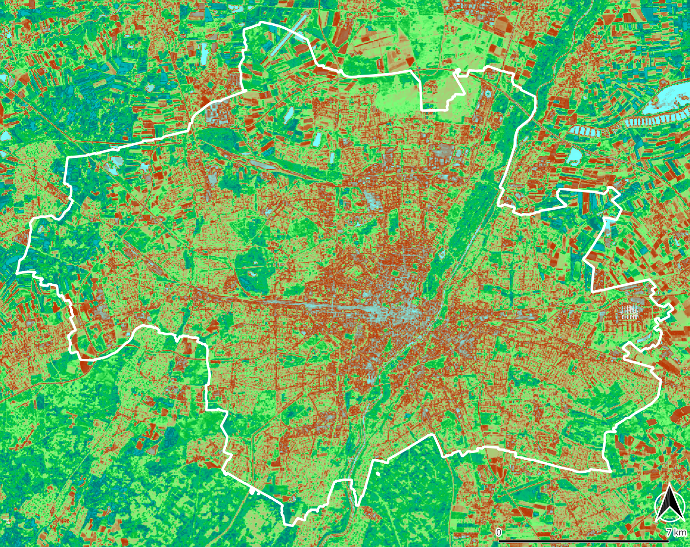
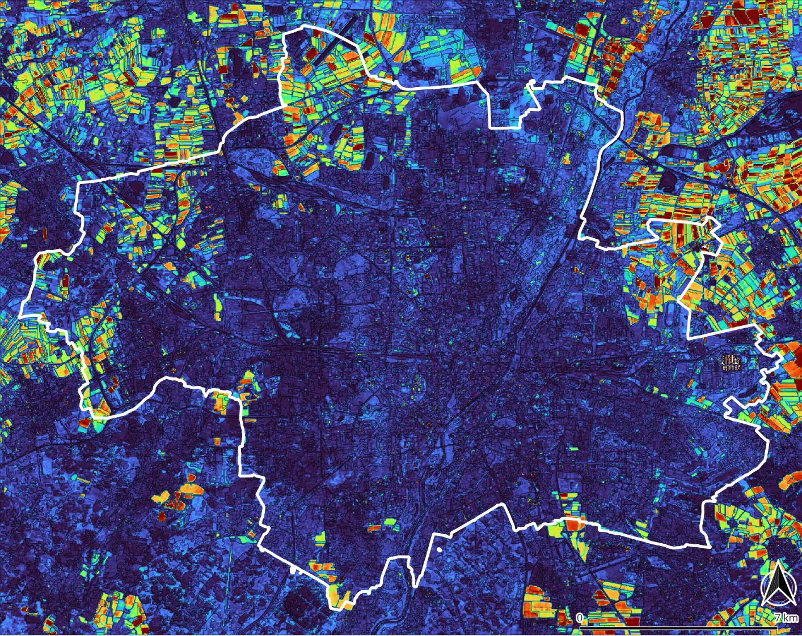

**[Home](../README.md) «» [Manual](../manual/README.md) «» [Tutorial](../tutorial/README.md) «» [Background](../background/README.md) «» [Source](../source)**

[TOC]

------

## 3 Indices and pixel arithmetic

Pixel arithmetic, kernel and indices are used to get new values from a specific collection of pixels. The collection might be a time line, neighbors or different spectral features of one pixel. The ratio of two, three or on rare occasions four different bands is traditionally used as an indicator for features that are not directly visible. The most well-known are the vegetation indices (NDVI, EVI, LAI, ...) and textural indices like roughness or Rao's Entropy (below). 

Besides comparing bands of one image, *Imalys* includes several routines to process time series and to analyze the vicinity of single pixels to control the image contrast or record local variability.


-----

### 3a Vegetation indices

*Imalys* has implemented four vegetation indices (*NDVI, NIRV, EVI, LAI*). The user should take into account that all vegetation indices are approximations. They assume spectral dependencies and also depend on the type of the sensor.

In addition to vegetation indices, there are numerous other methods to derive proxies for features such as soil moisture from the visible image data. 

```
IMALYS [tutorials 3a]
home
	directory = ~/.imalys
	clear = true
	log = ~/ESIS/results
compile
	select = ~/ESIS/results/bestof_20220501-20220731.tif
reduce
	select = compile
	execute = NIRV
	execute = NDVI
	formula = B3:B4
export
	select = NIRV
	target = ~/ESIS/results/NIRV_20220501-20220731.tif
export
	select = NDVI
	target = ~/ESIS/results/NDVI_20220501-20220731.tif
```

Tutorial 3a demonstrates how to calculate two vegetation indices from previously stored results. The [compile](../manual/4_Compile.md) command selects the "summer" scene and restores it as "compile" to the working directory. 

The [reduce](../manual/5_Reduce.md) command calculates the vegetation index *NDVI* and the metabolism index *NIRV*. To calculate the indices, the position of the red and the near infrared bands within the image must be passed as *formula*. The band numbers are natural numbers and start with “1” for the first band in the image. If different commands use he same image, the *reduce* commands can be concatenated. 

Two [export](../manual/11_Export.md) commands save the results as Geo-Tiff files in the *results* directory.

Tutorial 4c will need the vegetation index of summer and autumn. Try to change the time periods in tutorial 3a corresponding to [tutorial 2s](2_Images.md).



*Fig. 3.2: Near Infrared vegetation Index (NIRV) calculated from the optimized training examples at autumn 2022 ⬥ City of Munich ⬥ Landsat 8/9 ⬥ Mai to July 2022 ⬥ values 0 … 0.4 · The image uses a QuantumGIS [color table](../images/NirV.qml) for NIRV indices.*

------

### 3b Time series and change

Image data from remote sensing are snapshots that show arbitrary differences. All tutorials above use the median of a short time course to return “typical” image values (see [Median](../manual/5_Reduce.md). Sentinel 2 and Landsat 8/9 have been in operation since 2016 and 2014 respectively. Landsat sensors (TM, ETM and OLI) allow time series over 40 years. The training samples provide images for one year. Tutorial 3b (below) uses the *variance* process to show the changes between May and October. 



*Variance of seasonal change between summer and autumn in Munich. The change due to growth and harvesting is clearly differentiated from the settlement and even the natural change between summer and autumn in the north of the city ⬥ Year: 2022 ⬥ Sensor: Landsat 8/9 ⬥  Bands: 2 – 7 ⬥ Values: 0.0 (blue) – 0.7 (red)*

---

To analyze changes over a longer period at least three to five years should be included [see reduce](../manual/5_Reduce.md). The *variance* calculates the “variability” of each pixel using the Gaussian formulae. *Regression* quantifies a linear trend in time. Using the *retain = bands* option each band is calculated individually. If no time stamp is provided at the end of he filename, all images will be treated as of equal distance. Both formulae assume a normalized distribution of the values.

```
IMALYS [tutorial 3b]
home
	directory = ~/.imalys
	clear = true
	log = ~/ESIS/results
compile
	select = ~/ESIS/results/bestof_20220501-20220731.tif
	select = ~/ESIS/results/bestof_20220801-20221031.tif
reduce
	select = compile
	execute = brightness
	execute = variance
export
	select = brightness
	target = ~/ESIS/results/brightness_2022.tif
export
	select = variance
	target = ~/ESIS/results/variance_2022.tif
```

Tutorial 3b shows how to calculate the *variance* of the seasonal differences during the year 2022 an the overall *brightness* for the whole vegetation period. To get the changes over the whole vegetation period all images from May to October 2022 are extracted and compiled to one large image stack. 

For time series over more than one year, the seasons should be taken into account. In mid-latitudes, the seasonal differences are usually much greater than the change within the years. All image data for one result should therefore be recorded at the same season.

The *regression* process can be called exactly in the same way. As the *variance* will show the magnitude of the changes, the *regression* will indicate the direction. 

------

### 3c Contrast and Diversity

*Kernel* processes assign a new value to each pixel. The new value is compiled from a small window (kernel) and assigned to the central pixel of the kernel. *Kernels* can be used to determine the local roughness of an image or the local variability but also to modify the contrasts or enhance an elevation model.


*The first principal component of the normalized textures at “Hohes Holz” und “Großer Bruch” in the Bode catchment area: All optical bands from a 5x5 kernel ⬥ Sensor: Landsat-8 ⬥ Values: 0 (blue) to 0.42 (red) ⬥ Growing season 2014-2020*

---

In terms of biology, diversity is defined as the probability to record different species in one place. Indicators of landscape diversity have been a focus of our development. Spectral diversity or texture is traditionally used as a measure of ecological diversity in remote sensing. *Imalys* provides pixel based but also [zone](../manual/7_Zones.md) based methods to quantify spatial distribution and temporal changes of image structures. 

Textures return the “roughness” of an image. In the simplest case, this is the spectral difference between adjacent pixels in a small window (kernel). The [kernel](../manual/6_Kernel.md) is systematically dragged over the whole image. Each *kernel* defines one result pixel. In addition to the standard texture, the normalized texture (*normal*) and the Inverse Difference Moment according to Haralik⁵ (*inverse*) are implemented.

Structural features of image data can be strengthened or weakened using kernels. *Imalys* implements a *Laplace* transformation to amplify small-scale structures and a *LowPass* filter with a Gaussian kernel to enhance larger structures and reduce noise (see [kernel](../manual/6_Kernel.md)).

```
IMALYS [tutorial 3c]
home
	directory = ~/.imalys
	clear = true
	log = ~/ESIS/results
compile
	select = ~/ESIS/results/bestof_20220501-20220731.tif
	select = ~/ESIS/results/bestof_20220801-20221031.tif
kernel
	select = compile
	execute = texture
	execute = laplace
	radius = 2
export
	select = texture
	target = ~/ESIS/results/texture_2022.tif
export
	select = laplace
	target = ~/ESIS/results/laplace_2022.tif
```

Tutorial 3c shows how to calculate two different [kernel](../manual/6_Kernel.md) processes. Both use the same input and store their result with the name of the *execute* process at the working directory. The *texture* kernel returns the "roughness" of the image and depicts small scale structures. The *laplace* transformation uses a “Mexican head” function to enhance contrast and visualize boundaries. All *kernel* processes use the first principal component of all input bands to calculate their result. The [export](../manual/11_Export.md) command stores the result as Geo-Tiff at the *results* directory.

------

In mid-latitudes there are pronounced seasonal periods with  much larger differences than the mean changes over the years (see *3b: Time series and change*). The extent and direction of the periodic changes are a specific feature of many landscape types. Settlement areas show little periodic change, deciduous forests show significant but regular fluctuations and arable land both of them, high and irregular due to harvesting. 

In order to depict typical features, trends or outliers, the season of the images should be taken into account. For long time series images of the same season should be preferred. We got no problems to collect enough images for two 40 years time series of Germany. The "summer" version based on images for May to July and the "autumn" version with images for August to October. The results allow to map long and short time developments with the same datasets ([Germany Mosaic](https://doi.org/10.1594/PANGAEA.967266)).


*Long term variance of the NIRV plant metabolism index between 1984 and 2022 ⬥ Images taken between Mai and October ⬥ Values: 0.0 (blue) to 0.02 (red) ⬥ Sensor: Landsat 4, 5, 8, 9 ⬥ Frame: TK c7934 „Munich“.*

------


*Long term change (regession) of the NIRV plant metabolism index between 1984 and 2022 ⬥ Images taken between Mai and October ⬥ Yearly change: -0.002 (red) to 0.002 (green) ⬥ Sensor: Landsat 4, 5, 8, 9 ⬥ Frame: TK c7934 „Munich“*

------

Although the change between different seasons is maximal in arable land, the yearly vegetation index remains almost constant for the last 40 years. In forests, permanent green and the city of Munich the greening effect due to higher carbon dioxide concentrations is dominant.  

------

### 3d Outliers

Outliers in time series are often also outliers in space, e.g., construction sites or forest fires. Outliers in space are easy to detect, especially if previously visible boundaries ([zones](../manual/7_Zones.md)) have been created. If possible, the analysis should always use both aspects.


*Time course of the vegetation index NIRv between 2010 and 2020 (yellow) compared with the year 2018 (green). Based on MODIS-Terra images of green areas in the city of Leipzig.*

------

High resolution optical sensors are not suitable to detect changes over days or weeks. Radar (e.g. Sentinel-1 in C-Band) provide an image every 2-3 days. Using radar the date of a rapid change (e.g. harvest) can be determined but the nature of the change has to be recognized in another way. Radar backscatter and polarization are very different from optical images. Smooth, built-up objects usually show a high backscatter. Corner reflectors e.g. power lines can mimic much larger objects.

Optical sensors such as MODIS Terra provide data on a daily basis, but with at least 10 times lower spatial resolution than Landsat or Sentinel-2. Combining temporal high-resolution images with spatial high-resolution images allows sudden changes to be detected and helps to adjust single recordings to typical states of annual changes, thus making random recording dates easier to interpret.

------

### 3e Rao’s Entropy

Texture as a measure of diversity has the disadvantage that even a monoculture can show a high texture due to a “rough” surface. Rao’s entropy evaluates spectral and spatial differences simultaneously. Regular patterns show lower values than the classical texture. The main concept is to compare each pixel with each other in a given kernel. Thus regular pattern with high texture like a forest canopy will show low to moderate diversity. Random distribution will show the highest values. 

Using single pixels the calculation of Rao’s entropy is quite demanding and the result shows a considerable blurring. *Imalys* implements Rao’s approach as a *feature* of [zones](../manual/6_Zones.md). The [entropy](../manual/7_Features.md) parameter preserves landuse boundaries and can determine the diversity for structures consisting of only a few pixels.

```
IMALYS [tutorial 3e: Rao's diversity]
home
	directory = ~/.imalys
	clear = true
	log = ~/ESIS/results
compile
	select = ~/ESIS/results/bestof_20220501-20220731.tif
kernel
	select = compile
	execute = entropy
	radius = 3
export
	select = entropy
	target = ~/ESIS/results/entropy_20220501-20220731.tif
```

Tutorial 3e shows how to calculate Rao's Entropy based on pixels. [Tutorial 4b](4_Zones.md) includes a similar calculation based on [zones](../manual/7_Zones.md). It might be interesting to compare the results.

------

[Top](3_Indices.md)