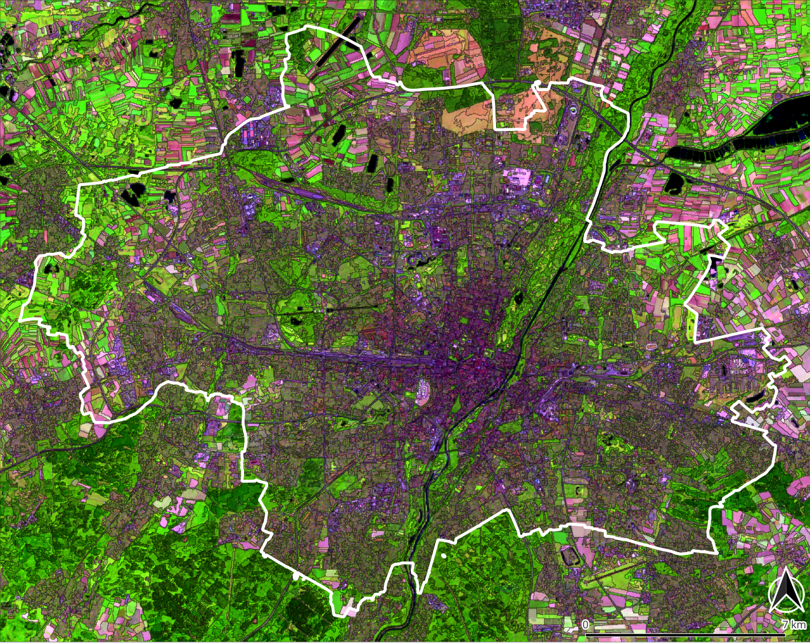
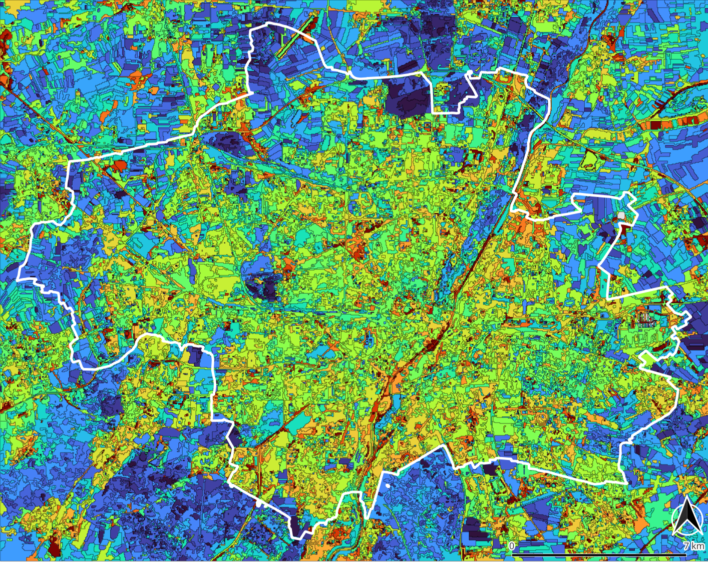

**[Home](../README.md) «» [Manual](../manual/README.md) «» [Tutorial](../tutorial/README.md) «» [Background](../background/README.md) «» [Source](../source)**

[TOC]

------

## 4 Homogeneous image elements (zones)

In *Imalys*, the term “zones” stands for a seamless part of the image with largely identical pixel features. [Zones](../manual/7_Zones.md) can be captured and used as polygons. This technique resembles the Object Based Image Analysis (OBIA) (Blaschke 2014). The delineation process only depends on the image data. The mean size of the resulting *zones* can be limited as needed. 

*Zones* have a geometry, spectral features like pixels, internal features like diversity and individual neighbors. The boundaries between the [zones](../manual/7_Zones.md) represent boundaries of land coverage. All features of individual *zones* are quantified as attributes of the *zones*. As *zones* cover the whole image, individual features can be compared and linked between neighboring *zones* across large regions (see [mapping](7_Mapping.md)).

------

### 4a Natural boundaries

The delineation process of [zones](../manual/7_Zones.md) is based on an algorithm to minimize the variance within all *zones* of the image. Details are explained at [background](../manual/background) chapter. The algorithm can process any type of image, regardless of the image source (microwave, altitude data, light, …), the scale or the number of bands.



*Fig. 4.1: Structural landscape elements at the city of Munich (Germany). Zones with different combinations of optical characteristics are delineated by narrow dark lines. Once created, zones can be processed separately from the image data ⬥ Sensor: Landsat 8/9 ⬥ Time: August – October 2022*

------

The average size of the [zones](../manual/7_Zones.md) *size* can be freely selected. The process starts with *zones* of individual pixels and gradually removes boundaries between existing *zones* until the mean size reaches the passed threshold. The order in which the boundaries are removed does not depend on the final size. This means that larger *zones* can act as a second-degree order for smaller ones. Larger *zones* inherit the boundaries of the smaller ones. 

If bands with very different value ranges are used to delineate [zones](../manual/7_Zones.md), the bands with the largest numerical values dominate the position of the boundaries. In this case it may be useful to [normalize](../manual/8_Features.md) the values of the different bands before processing so that all features will have the same influence on the result.

Size and shape of the zones should fit your intentions. *Bonds = high* will restrict the differences in size between all *zones*. *Size* will control the mean size of the zones. No entry combination will fit all purposes. It is convenient to test different entries of the parameters *bonds* and *size*. To simplify the comparison a quick overview of the boundaries ("zones.shp") is created at the working directory even if no [export](../manual/11_Export.md) is induced.

```
IMALYS [tutorial 4a]
home
	directory = ~/.imalys
	clear = true
	log = ~/ESIS/results
compile
	select = ~/ESIS/results/bestof_20220501-20220731.tif
	select = ~/ESIS/results/bestof_20220801-20221031.tif
	names=blue², green², red², NIR², SWIR², MWIR², blue³, green³, red³, NIR³, SWIR³, MWIR³
	target = spectral
zones
	select = spectral
	size = 30
	bonds = low
export
	select = zones
	target = ~/ESIS/results/zones.shp
```

Tutorial 4a shows how to create zones and export them as attributed polygons. The image data are taken from an earlier result. [Compile](../manual/4_Compile.md) is used to return the images to the working directory. In the above The result of the *compile* command is renamed to *spectral*. This is necessary because a second *compile* at tutorial 4b would overwrite the result of the first *compile*.

-----

### 4b Spectral and structural features

The [features](../manual/8_Features.md) command resets the attribute table of the [zones](../manual/7_Zones.md). The shape of the *zones* remains unchanged.



*Fig. 4.2: Normalized texture (texture / brightness) at the city of Munich (Germany). The build up area is clearly differentiated from forested (south) and agricultural areas (north). Due to the normalizing very dark zones as the Isar river, some motorways and small lakes also show high values ⬥ Process: Normal ⬥ Year: 2022 ⬥ Values: 0.03 (blue) to 0.21 (red) ⬥ Sensor: Landsat-8/9 ⬥ Site: City of Munich (Germany)*

-----

The [features](../manual/8_Features.md) of the *zones* can be calculated independently from the geometry of the [zones](../manual/7_Zones.md). Features can be derived from form and size of the zones, from the neighborhood of the zones and from the spectral properties within individual zones. Pixel features like texture or diversity can benefit considerably from a *zone* based calculation (see [manual](../manual/8_Features.md)). Diversity and distribution of different pixel features can be used together with diversity and distribution of different *zones* to evaluate and compare structural properties in two different scales at the same time. The *feature* calculation can be repeated as often as necessary without changing the *zone* boundaries (see [features](../manual/8_Features.md)).

To delineate hydrological catchments or follow possible sources of water pollution and toxicology a hydrological drainage model is available (see [mapping](../manual/9_Mapping.md)) that returns a synthetic runoff model formatted as a line vector with the drained regions as parameters.

The *size* of the zones depends on a selectable parameter and thus it cannot be used to compare images. All other structural attributes return relative values that are independent of the absolute size of the zones as far as possible.

Usually the shape and size of the [zones](../manual/7_Zones.md) are not randomly distributed, they form regions or corridors with similar characteristics. *Diffusion* strengthens locally dominant features in a similar way to a low pass filter and thus makes focal points more visible. The algorithm follows Alan Turing’s suggestion to understand patterns as a consequence of diffusing fluids.

```
IMALYS [tutorial 4b “features”]
home
	directory = ~/.imalys
	log = ~/ESIS/results
compile
	select = ~/ESIS/results/NIRV_20220501-20220731.tif
	select = ~/ESIS/results/NIRV_20220801-20221031.tif
	select = ~/ESIS/results/entropy_20220501-20220731.tif
	names = NIRV², NIRV³, entropy²
features
	select = spectral
	include = compile
	execute = entropy
	execute = texture
	execute = cellsize
	execute = dendrites
	execute = proportion
	execute = relation
	execute = diversity
	values = true
export
	select = zones
	target = ~/ESIS/results/zones.shp
export
	select = index
	target = ~/ESIS/results/index_2022
export
	select = values
	target = ~/ESIS/results/values_2022.tif
```

Tutorial 4b shows how to create an attribute table from the previous delineated [zones](../manual/7_Zones.md). The working directory must not be cleared between tutorial 4a and 4b.

»*Select* = *spectral*« under *features* assigns the color images from summer and autumn as attributes. »*Select = … NIRV …*« and »*select* = … *entropy* …« under *compile* prepare the three optical bands for further processing and »*include* = *compile*« appends them as additional pixel attributes. The *spectral* and the *compile* image must be exactly of the same size. The *execute* parameters calls different features of the [zones](../manual/7_Zones.md). The *values* parameter creates a control image with all features as raster layers. 

»*Select* = *zones*« under [export](../manual/11_Export.md) saves the *zones* and all attributes as a vector layer to the passed location. »*Select* = *index*« under *export* saves the definition files of the *zones* to the passed directory. The definition files can be restored using the [import](../manual/3_Import.md) command.

*Entropy* and *texture* under *features* are pixel attributes that were already calculated in tutorial 3. It might be interesting to compare the *zone* related results with the traditional kernel approach by opening the control image *values_2022.tif*

------

### 4c Concatenate process chains

The tutorials 4a and 4b bust be processed immediately one after he other to presave the intermediate results in the process chain. A longer process chain does the same without interrupt.

```
IMALYS [tutorial 4c]
home
	directory = ~/.imalys
	clear = true
	log = ~/ESIS/results
compile
	select = ~/ESIS/results/bestof_20220501-20220731.tif
	select = ~/ESIS/results/bestof_20220801-20221031.tif
	names=blue², green², red², NIR², SWIR², MWIR², blue³, green³, red³, NIR³, SWIR³, MWIR³
	target = spectral
zones
	select = spectral
	size = 30
	bonds = low
compile
	select = ~/ESIS/results/NIRV_20220501-20220731.tif
	select = ~/ESIS/results/NIRV_20220801-20221031.tif
	select = ~/ESIS/results/entropy_20220501-20220731.tif
	names = NIRV², NIRV³, entropy²
features
	select = spectral
	include = compile
	execute = entropy
	execute = texture
	execute = cellsize
	execute = dendrites
	execute = proportion
	execute = relation
	execute = diversity
	values = true
export
	select = zones
	target = ~/ESIS/results/zones.shp
export
	select = index
	target = ~/ESIS/results/index_2022
export
	select = values
	target = ~/ESIS/results/values_2022.tif
```

Tutorial 4c combines the two above examples to one continuous process.

------

[Top](4_Zones.md)


