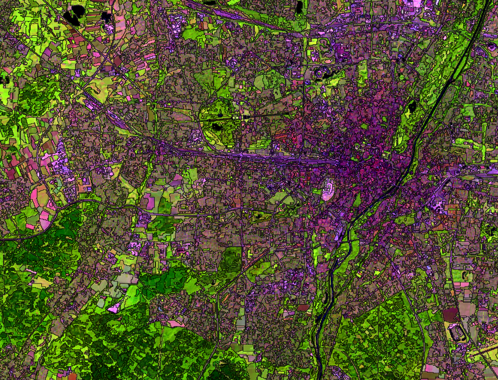
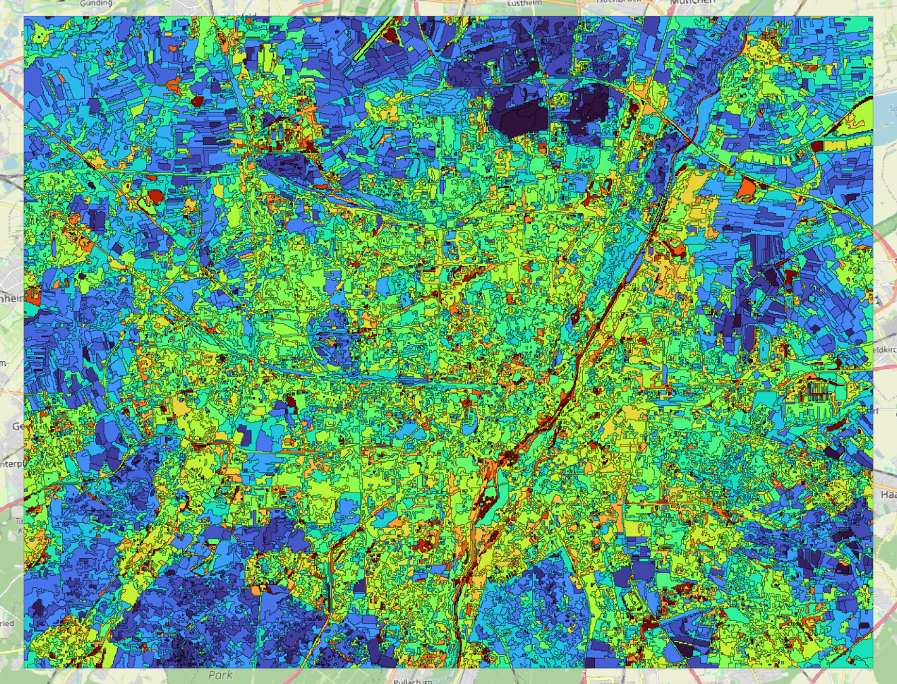

**[Home](../README.md) «» [Manual](../manual/README.md) «» [Tutorial](../tutorial/README.md) «» [Background](../background/README.md) «» [Source](../source)**

[TOC]

------

## 4 Homogeneous image elements (Zones)

In *Imalys*, the term “zones” stands for a seamless mapping of image data into areas with largely identical pixel features. [Zones](../manual/7_Zones.md) can be captured and used as polygons. This technique is also known as Object Based Image Analysis (OBIA) (Blaschke 2014). 

The shape, size and surroundings of the *zones* can be quantified as zone attributes (traits) and linked to other [features](../manual/8_Features.md). Pixel characteristics of individual *zones* can be recorded as mean values or as a time series. The textures and diversity of the pixels within individual *zones* can also be recorded and compared.

### 4a Natural Boundaries

The delineation process only depends on the image data and a parameter for the mean size of the *zones*. *Zones* have a geometry, pixel features and individual neighbors. The boundaries between the zones represent boundaries of land coverage. 



*Fig. 4.1: Structural landscape elements at the city of Munich (Germany). Zones with different combinations of optical characteristics are delineated by narrow dark lines. Once created, zones can be processed separately from the image data ⬥ Sensor: Landsat 8/9 ⬥ Time: Mai – October 2022*

------

The delineation process is based on an algorithm to minimize the variance within the [zones](../manual/7_Zones.md). Details are explained at [background](../manual/background) chapter. The algorithm can process any type of image, regardless of the image source (microwave, altitude data, light), the scale or the number of bands.

The average size of the [zones](../manual/7_Zones.md) *size* can be freely selected. The process starts with *zones* of individual pixels and gradually removes boundaries between existing *zones* until the mean size reaches the threshold. The order in which the boundaries are removed does not depend on the final size. This means that larger *zones* can act as a second-degree order for smaller ones. Larger *zones* inherit the boundaries of the smaller ones. 

If bands with very different value ranges are used, the bands with the largest numerical values dominate the position of the boundaries. In this case it may be useful to [normalize](../manual/8_Features.md) the values of the different bands before processing so that all features will have the same influence on the result.

```
IMALYS [tutorial 4a]
home
	directory = ~/.imalys
	clear = true
	log = ~/ESIS/results
compile
	select = ~/ESIS/results/Bands_summer.tif
	select = ~/ESIS/results/Bands_autumn.tif
zones
	select = compile
	size = 30
	bonds = low
export
	select = index
	target = ~/ESIS/results/Zones.shp
```

Tutorial 4a shows how to create zones and export them as attributed polygons. In contrast to the previous examples the image data are taken from an earlier result. [Compile](../manual/4_Compile.md) is used to return the images to the working directory.

The internal representation of the [zones](../manual/7_Zones.md) is an image with the zone ID as a value (*~/.imalys/index*), an ESRI Shape file with the boundaries (*~/.imalys/index.shp*), an attribute table (*~/.imalys/index.bit*) and a table of all the links between adjacent zones (*~/.imalys/topology.bit*). 

The [export](../manual/11_Export.md) command stores them as a geometry file with attributes. The ending of the *target* filename controls the file format.

-----

Size and shape of the zones should fit your intentions. *Bonds = high* will restrict the differences in size between all *zones*. *Size* will control the mean size of the zones. No entry combination will fit all purposes. It is convenient to test different entries of the parameters *bonds* and *size*. To simplify the comparison a *zones.shp* file is created at the working directory even if no [export](../manual/11_Export.md) is induced.

-----

### 4b Spectral and structural features

The [features](../manual/8_Features.md) of the *zones* can be calculated independently from the geometry of the [zones](../manual/7_Zones.md). Features can be derived from form and size of the zones, from the neighborhood of the zones and from the spectral properties of the images. Diversity and distribution of different pixel features can be used together with diversity and distribution of different zones to evaluate and compare structural properties in two different scales at the same time. The *feature* calculation can be repeated as often as necessary without changing the *zone* boundaries.

Spectral features are calculated as the mean of all pixels within one [zone](../manual/7_Zones.md). Structural features can be derived from the geometry and the connection of the *zones*. Some of them describe individual zones such as *size* (area) or *dendrites* (shape), others describe the connections to adjacent *zones* such as *relation* (density of neighbors) or *diversity* (spectral differences). New [features](../manual/8_Features.md) can rely on images that where not included in the delineation of the *zones* like an elevation model.



*Fig. 4.2: Normalized texture (texture / brightness) at the city of Munich (Germany). The build up area is clearly differentiated from forested (south) and agricultural areas (north). Due to the normalizing very dark zones as the Isar river, some motorways and small lakes also show high values ⬥ Process: Normal ⬥ Year: 2022 ⬥ Values: 0.03 (blue) to 0.21 (red) ⬥ Sensor: Landsat-8/9 ⬥ Site: City of Munich (Germany)*

-----

The [features](../manual/8_Features.md) command resets the attribute table of the [zones](../manual/7_Zones.md). The shape and all connections of the zones are obtained directly from the geometry of the zones. In addition, arbitrary image data such as height or [kernel](../manual/6_Kernel.md) results can be linked to the zones as external attributes by the *select* parameter. *Features* was therefore implemented as an independent process. 

The *size* of the zones depends on a selectable parameter and thus it cannot be used to compare images. Therefore all other structural attributes return relative values that are independent of the absolute size of the zones.

Two commands compare the shape and size of the zones with the local environment. *Proportion*  gives the ratio of the central zone to all connected zones. The value is greater than one if the central zone is larger than the mean of the neighbors. *Relation* gives the ratio between the perimeter and the number of connected *zones*.

Usually the shape and size of the [zones](../manual/7_Zones.md) are not randomly distributed, they form regions or corridors with similar characteristics. *Diffusion* strengthens locally dominant features in a similar way to a low pass filter and thus makes focal points more visible. The algorithm follows Alan Turing’s suggestion to understand patterns as a consequence of diffusing fluids.

If corridors, i.e. paths with favorable conditions for exchange, are to be found, a hydrological drainage model [runoff]() is available, which does not only have to use elevation data. A classification ([mapping](../manual/9_Mapping.md)) including image objects can also be used to record large scale spatial links.

```
IMALYS [tutorial 4b “features”]
home
	directory = ~/.imalys
	log = ~/ESIS/results
compile
	select = ~/ESIS/results/Bands_summer.tif
	select = ~/ESIS/results/Bands_autumn.tif
	select = ~/ESIS/results/NirV.tif
	select = ~/ESIS/results/LowPass.tif
features
	select = compile
	execute = entropy
	execute = normal
	execute = cellsize
	execute = dendrites
	execute = proportion
	execute = relation
	execute = diversity
	values = true
export
	select = index
	target = ~/ESIS/results/Zones.shp
```

**The results of earlier tutorials must be retained!**

Tutorial 4b shows how to create an attribute table from images and the geometry of the [zones](../manual/7_Zones.md). The images must exist. If more than one image should be transferred, all images must be stacked using the [compile](../manual/4_Compile.md) command and selected as one image. Shape, size and connection of the *zones* only relay on the geometry of the *zones*. They are created by the given parameters like *dendrites* or *proportion*. Some of them like *diversity* relay on both, spectral and geometrical features. Without spectral input they will not work (see [features](../manual/8_Features.md)). 

The *values* parameter creates an additional image with all attributes as image layers. The command serves as a control to visualize the vector attributes table.  

The [export](../manual/11_Export.md) command links geometry and attributes of the *zones* to one dataset. There is no other way to create a GIS layer from *zones* and their attributes.

[Top](4_Zones.md)
