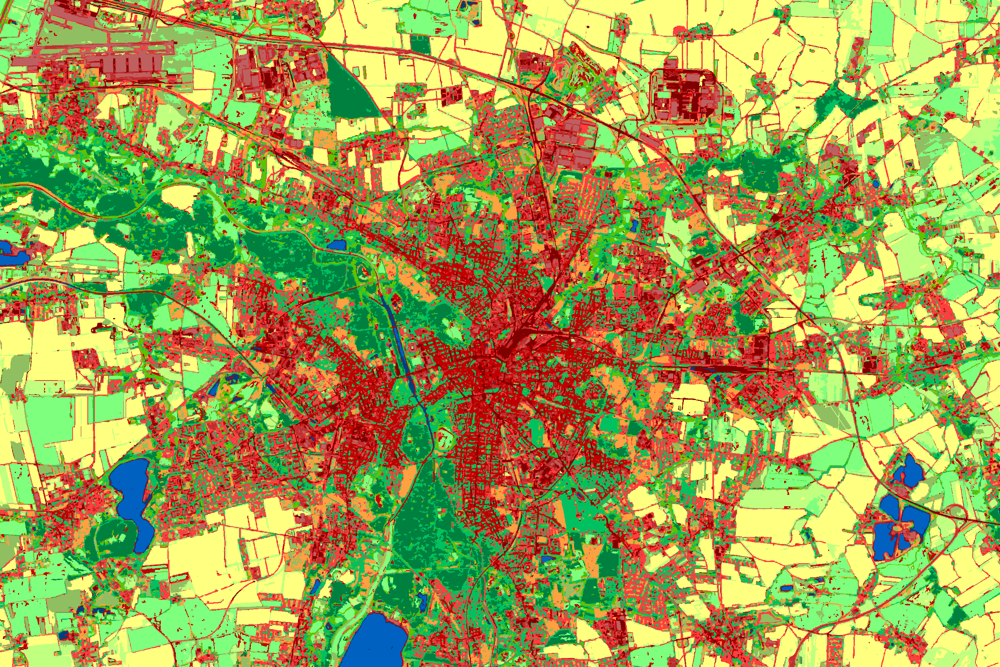
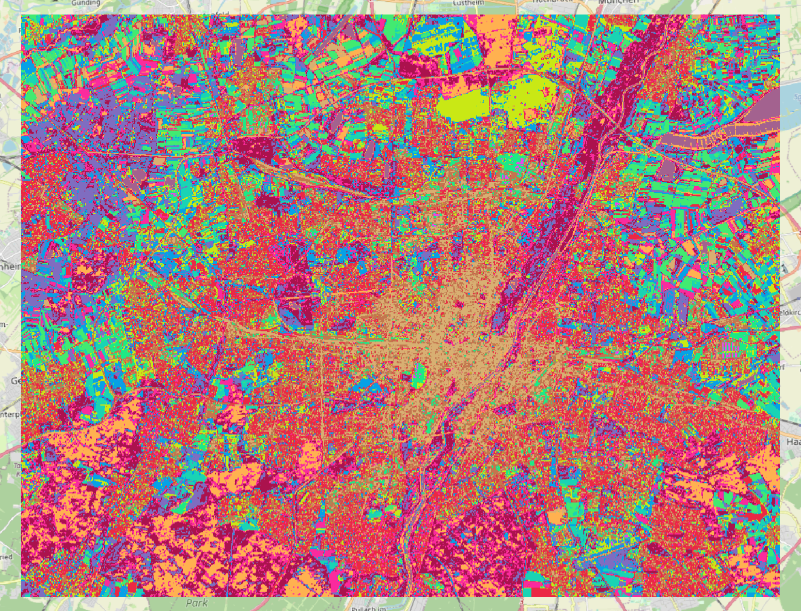
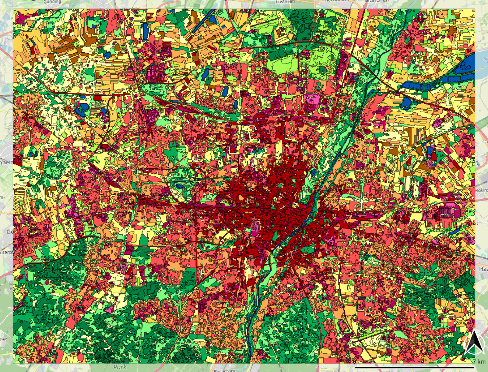
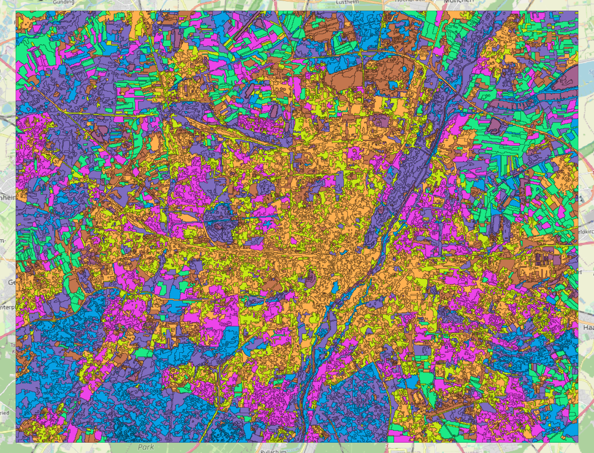
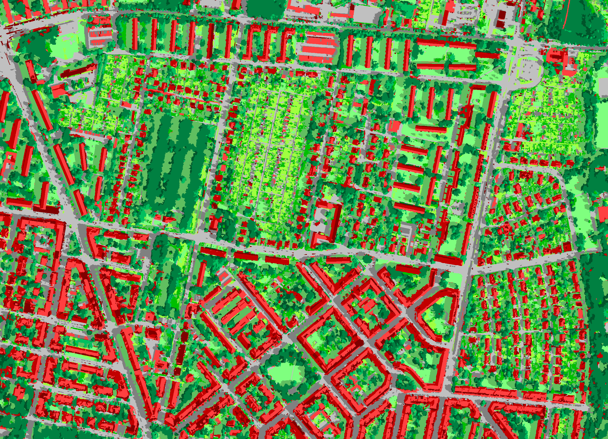

**[Home](../README.md) «» [Manual](../manual/README.md) «» [Tutorial](../tutorial/README.md) «» [Background](../background/README.md) «» [Source](../source)**

[TOC]

------

## 5 Classification and pattern analysis

Imalys provides a fully automatic classification of image features [mapping](../manual/8_Features.md). The process can use pixels or [zones](../manual/7_Zones.md) and in an advanced version pattern analysis based on *zones* that we call *objects*.

The purely statistical object classification without any training ([mapping](../manual/9_Mapping.md)) was sufficient to separate roof surfaces, streets, parks, small gardens and other urban elements from two very different images of the city of Leipzig. Fig.5.1 shows the result for a satellite image, Fig.5.3 the result for an areal image of the Gohlis district.



*Fig.5.1: Attributes and spatial patterns of 30 self-calibrating object classes of Leipzig (Germany) were assigned to 16 final classes ⬥ Image data: Sentinel-2 ⬥ Date: 16.9.2018 ⬥ Bands: 8-4-3-2 ⬥ Process: Mapping ⬥ Colors: User defined*

-----

Imalys implements methods to map image features of all kinds into separate groups or clusters ([mapping](../manual/9_Mapping.md)). The result reflects feature combinations that are common in the classified image. *Mapping* can classify images at three levels: 

1. Pixels based using the spectral combinations of single pixels
2. Zones based using the combination of selected [zones](../manual/7_Zones.md) attributes
3. Object based using the connections between classified *zones*

The principle is the same in each case. Features or properties create a multidimensional feature space. Local concentrations of feature combinations in this n-dimensional space are detected and separated into a passed number of classes. 

------

### 5a Pixel based classification

The unsupervised classification of pixels based on spectral combinations is a standard procedure ([mapping](../manual/9_Mapping.md)). The result mainly depends on the selection and quality of the image base (see [reduce](../manual/5_Reduce.md)).



*Fig. 5.1: Result of the pixel based *mapping* command as shown in the tutorial 5a. 14 most common spectral combinations are assigned to 14 classes ⬥ Sensor: Landsat 8 ⬥ Time: May to October 2022 ⬥ Bands 2 – 7 ⬥ Colors: Random*

------

Deriving basic land use types from spectral image data can be unreliable because land use types are defined by their purpose and not by their appearance in the image. Machine learning can recognize almost any pattern, but needs to be trained using examples. Only trained patterns can be recognized. The training might even take longer than manual classification.

```
IMALYS [tutorial 5a]
home
	directory  =  ~/.imalys
	clear  =  true
	log  =  ~/ESIS/results
compile
	select  =  ~/ESIS/results/Bands_summer.tif
	select  =  ~/ESIS/results/Bands_autumn.tif
mapping
	select  =  compile
	classes  =  14
	samples  =  30000
export
	select  =  mapping
	target  =  ~/ESIS/results/Automap.tif
```

Tutorial 5a shows how to classify a multispectral and multitemporal image for 14 spectral clusters. The images in the *results* folder must exist. The *samples* are used to train the classifier. The number of the *samples* should be at least 1000 times larger than the *classes*. If rare features should be classified, a higher number might be necessary. [Mapping](../manual/9_Mapping.md) stores the result image and the class definition to the working directory. [Export](../manual/11_Export.md) saves both as to the *results* directory of the user.

------

### 5b Zone based classification

[Zones](../manual/7_Zones.md) must be created before the classification but *zones* [features](../manual/8_Features.md) can provide additional properties derived from the size, shape and connections of the *zones*. The spectral features of *zones* are the mean of all pixels that contribute to the *zone*. *Zones* and spectral classes complement each other. *Zones* summarize typical pixel features for a limited area. Classification sorts them into a manageable list of feature combinations. Typical problems with clustering pixels such as “pepper and salt” patterns do not occur anymore. Boundaries are clearly delineated.



*Fig. 5.2: Result of the zones based *mapping* command of the tutorial 5b. 14 most common feature combinations are assigned to 14 classes ⬥ Sensor: Landsat 8 ⬥ Time: May to October 2022 ⬥ Bands 2 – 7 ⬥ manual colors*

------

The spectral differentiation of natural areas becomes more reliable when images from different seasons are used together. Images of equal seasons may originate from different years. A logical combination of very different parameters, including the color, shape, distribution and development of surface characteristics, may provide a robust alternative to machine learning without extensive training (Banzhaf 2018).

[Zones](../manual/7_Zones.md) and their features provide an abstraction of the image that makes classification easier. Both lessons 5a and 5b use the same input data and the same number of classes. The spacial abstraction provided by the *zones* combines with the spectral abstraction by the classification process to return a superior result.   

```
IMALYS [tutorial 5b]
home
	directory = ~/.imalys
	clear = true
	log = ~/ESIS/results
compile
	select = ~/ESIS/results/Bands_summer.tif
	select = ~/ESIS/results/Bands_autumn.tif
zones
	select = compile
	bonds = low
	size = 30
features
	select = compile
mapping
	select = index
	classes = 14
	samples = 30000
export
	select = mapping
	target =  ~/ESIS/results/Mapping.tif
```

Lesson 5b shows how to classify zones instead of pixels. The input (*select*) is identical to the lesson 5a. To classify zones instead if images the raster part (*index* and *index.hdr*) of the *zones* definition must be called ([mapping](../manual/9_Mapping.md)). The classification result *mapping* can be exported as usual. Different classes are visualized by a color palette.

------

### 5c	Object based classification

Classified zones can be combined by a second level classification to form “objects” ([mapping](../manual/9_Mapping.md)). Objects are only defined by the intensity of the connections between the different *zones*. The connection intensities form patterns that can be classified. The result describes a typical pattern of different spectral and spatial properties. These classes are hereinafter referred to as “objects”. For details refer to the [background](../manual/Background.md) section.



*Fig. 5.4: Result of the tutorial 5c with only 8 self adjusting classes to generalize the city of Munich and its environment. The *object* process differentiates between city types, permanent green, forest, agriculture and water but especially the agriculture part lacks sufficient training samples. A higher number of classes will return worse results ⬥ Sensor: Landsat 8 ⬥ Time: May to October 2022 ⬥ Bands 2 – 7 ⬥ Random colors*

------

The objects size is not limited. Simple patterns of different [zones](../manual/7_Zones.md) can be repeated over a large area to form one *object*. Large *zones* usually form *objects* of one dominant zone and many smaller ligands. In practice the mean *size* of the *zones* can be crucial. The *size* should be selected in such a way that homogeneous *objects* are not reduced to a lot of partitions, whereas heterogeneous *objects* can be represented by a sufficient number of smaller *zones*.

As *objects* can consist from a few to several hundred [zones](../manual/7_Zones.md) the supplied images must be large enough to provide sufficient training *samples* in order to recognize typical patterns. The images in this tutorial are rather small. Many combinations of color and shape remain isolated cases and cannot be trained properly. The tutorial with only eight different classes shows how basic structural types in the urban areas can be separated from each other. For the agricultural area a larger image would be required. Fig.5.1 and Fig.5.4 show results of the *object* analysis with larger images.

```
IMALYS [tutorial 5c]
home
	directory = ~/.imalys
	clear = true
	log = ~/ESIS/results
compile
	select = ~/ESIS/results/Bands_summer.tif
	select~/ESIS/results/Bands_autumn.tif
zones
	select = compile
	bonds = low
	size = 30
features
	select = compile
mapping
	select = index
	classes = 8
	samples = 80000
	fabric = 1
export
	select = mapping
	target = ~/ESIS/results/Objects.tif
```

Lesson 5c: The call of an *object* based classification is almost identical to a *zones* based even if the internal processes differ considerably. The only difference is the *fabric* option that triggers the search for connected zones. Higher values for the *fabric* parameter extend the area of the pattern detection process.

-----

### 5d Extended object features

Objects are not restricted to certain scales or spectral data. In order to compare the self adjusting *object* classification with a highly developed rule-based classification (Banzhaf), the same image data were classified as *objects*. 



*Fig. 5.4: Object classification of the Gohlis district of the city of Leipzig (Germany). The spatial patterns of 500,000 [zones](../manual/7_Zones.md) were reduced by a self-calibrating analysis to 30 basic classes, which were assigned to 13 named classes ⬥ Image sources: Infrared aerial photos and elevation model of the State of Saxony ⬥ Colors: User defined*

-----

Due to the statistical base of the method, objects definitions describe objects that are common in one image. Other landscapes or a different season can invalidate the definitions. This means that the results can only be transferred into images with the same structure. The technology has the advantage that it does not require any training or prior information. The result is only determined by the image data. The technical implementation is described in detail in the [background]() chapter.

------

### 5e Comparison, class reference

ESIS offers the command [compare](../manual/10_Compare.md), which allows to compare any classification result with references. *Compare* uses a rank correlation to become independent of the data distribution. *Compare* returns two cross reference tables between the most recent classification result an a reference given as raster image or as polygons.

[Compare](../manual/10_Compare.md) works with each distribution and can therefore analyze any pattern. As an alternative, the degree of correlation can be estimated according to *ChiSquare* (X²). Strictly speaking, X² presupposes standard distribution, but can then be more selective.

-----

**Elze, S.; Banzhaf, E:** High-precision monitoring of urban structures to understand changes in multiple ecosystem services. Urban For. Urban Green. 2022, 73, 127616.

[Top](5_Mapping.md)
